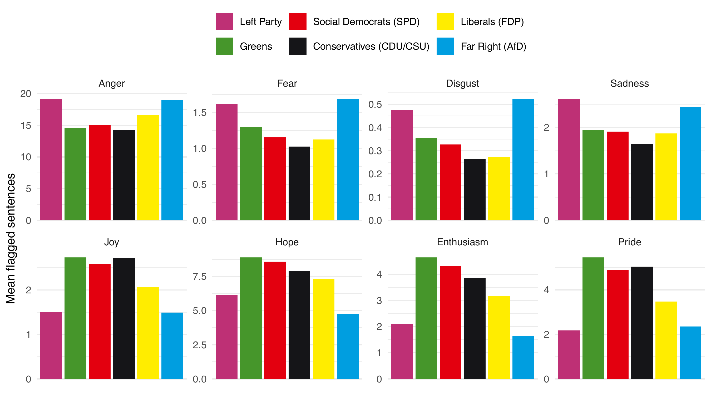
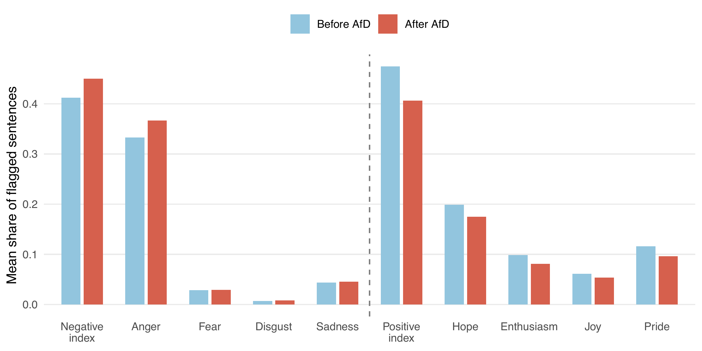
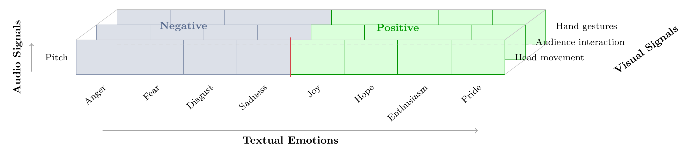
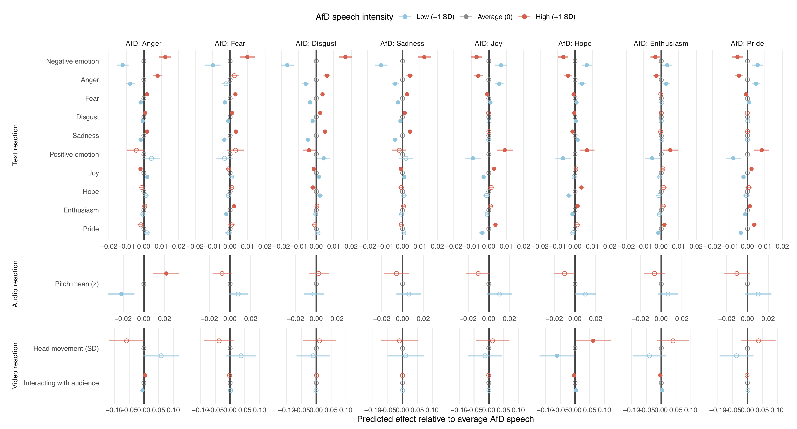
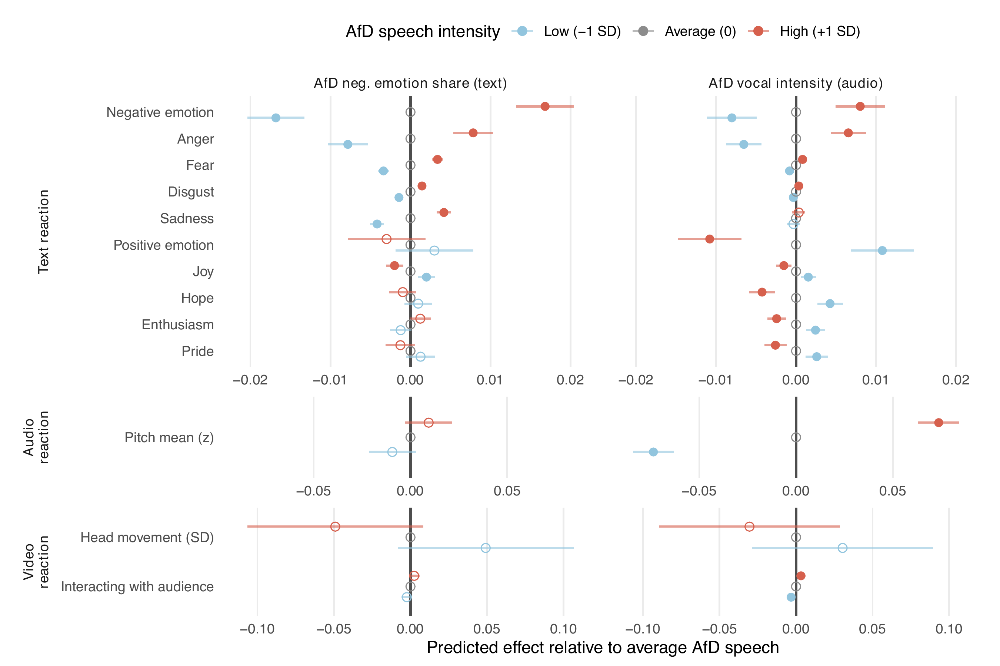

## The Question and the Existing Answer


::: {style="text-align:center;"}
**Does far-right parliamentary success make democratic debate more negative?**
:::

&nbsp;

::: {.columns}
::: {.column width="50%" .fragment}
**Valentim & Widmann (2023)**

- AfD entry into German state parliaments
- Established parties **do not** imitate far-right negativity
- Instead: **more positive** emotional language
- Interpretation: rhetorical distancing from a norm-breaking actor
:::
::: {.column width="50%" .fragment}
**But this is an average, entry-level, text-based result**

- Aggregates across speeches and time
- Cannot reveal *immediate* reactions within debates
- Cannot capture *how* responses are delivered
:::
:::

---

## What the Average Misses

::: {.columns}
::: {.column width="49%" .fragment}
```{=html}
<div style="border-left:4px solid #2a7ab5; background:#f0f5fb; padding:0.4em 0.8em; margin-bottom:0.7em;">
<strong>The Sequential Dimension</strong>
</div>
```

Parliamentary debate is *ordered*: speeches respond to prior speeches within agenda items.

- What happens immediately following an AfD speech?
- **Expected**: anger ↑, positive language ↓; even if the aggregate is positive
:::
::: {.column width="2%"}
:::
::: {.column width="49%" .fragment}
```{=html}
<div style="border-left:4px solid #2a7ab5; background:#f0f5fb; padding:0.4em 0.8em; margin-bottom:0.7em;">
<strong>The Multimodal Dimension</strong>
</div>
```

Speech is not only text: legislators communicate through pitch, head movement, and gestures.

- Do responses become vocally and visually activated?
- Are these channels coupled, or do they move independently?
- **Expected**: text follows text, pitch follows pitch, visuals follow visuals
:::
:::

---

## Research Design and Case Selection

**Research design**

```{=html}
<div style="font-size:0.95em; margin-top:0.3em; margin-bottom:1.5em;">
  <p style="font-size:0.74em; font-weight:600; color:#666; text-transform:uppercase; letter-spacing:0.05em; margin:0 0 0.4em 0; text-align:center;">One Agenda Item</p>
  <table style="width:100%; border-collapse:separate; border-spacing:4px; table-layout:fixed; margin-bottom:0.15em;">
    <tbody><tr>
      <td style="background:#dde8f4; border:1px solid #2a7ab5; border-radius:3px; padding:0.5em 0.1em; text-align:center; font-size:0.72em; color:#1a1a2e;">Speech</td>
      <td style="background:#dde8f4; border:1px solid #2a7ab5; border-radius:3px; padding:0.5em 0.1em; text-align:center; font-size:0.72em; color:#1a1a2e;">Speech</td>
      <td style="background:#dde8f4; border:1px solid #2a7ab5; border-radius:3px; padding:0.5em 0.1em; text-align:center; font-size:0.72em; color:#1a1a2e;">Speech</td>
      <td style="background:#C5050C; border:2px solid #8b0000; border-radius:3px; padding:0.5em 0.1em; text-align:center; font-size:0.78em; font-weight:700; color:white;">Far Right</td>
      <td style="background:#fff3cd; border:1px solid #c8a000; border-radius:3px; padding:0.5em 0.1em; text-align:center; font-size:0.72em; color:#1a1a2e;">Speech</td>
      <td style="background:#fff3cd; border:1px solid #c8a000; border-radius:3px; padding:0.5em 0.1em; text-align:center; font-size:0.72em; color:#1a1a2e;">Speech</td>
      <td style="background:#fff3cd; border:1px solid #c8a000; border-radius:3px; padding:0.5em 0.1em; text-align:center; font-size:0.72em; color:#1a1a2e;">Speech</td>
    </tr></tbody>
  </table>
  <table style="width:100%; border-collapse:collapse; margin-bottom:0.6em;">
    <tbody><tr>
      <td style="width:43%; text-align:center; color:#2a7ab5; font-weight:600; font-size:0.7em; border:none; background:none; padding:0.15em;">← Before</td>
      <td style="width:14%; border:none; background:none;"></td>
      <td style="width:43%; text-align:center; color:#c8a000; font-weight:600; font-size:0.7em; border:none; background:none; padding:0.15em;">After →</td>
    </tr></tbody>
  </table>
  <table style="width:60%; margin:0 auto; border-collapse:separate; border-spacing:10px;">
    <tbody><tr>
      <td style="background:#dde8f4; border:1px solid #2a7ab5; border-radius:4px; padding:0.5em 1em; text-align:center; font-size:0.72em; color:#1a1a2e; border-bottom:1px solid #2a7ab5;">
        <strong>Before</strong><br>non far-right sentences
      </td>
      <td style="text-align:center; font-size:1em; font-weight:700; vertical-align:middle; background:none; border:none; border-bottom:none; padding:0 0.3em;">vs.</td>
      <td style="background:#fff3cd; border:1px solid #c8a000; border-radius:4px; padding:0.5em 1em; text-align:center; font-size:0.72em; color:#1a1a2e; border-bottom:1px solid #c8a000;">
        <strong>After</strong><br>non far-right sentences
      </td>
    </tr></tbody>
  </table>
</div>
```


::: {.fragment}
**Case Selection**

::: {style="font-size:0.82em; margin-top:0.2em; margin-bottom:0.4em;"}
49,662 speeches in ~15,000 hours of video:

| Parliament | Period | AfD from |
|:---|:---:|:---:|
| Hesse | 2013–2025 | 2019 |
| Saxony-Anhalt | 2021–2025 | 2021 |
| Saxony | 2019–2025 | 2019 |
| Baden-Württemberg | 2011–2025 | 2016 |
| Bundestag | 2017–2025 | 2017 |

:::
:::
---

## Average Distancing

**H1:** Non-AfD parties respond to AfD presence with more positive language (replication)

::: {style="text-align:center; margin-top:0.4em;"}
{width="72%" style="max-height:450px; object-fit:contain;"}
:::

---

## Average vs. Sequential Mirroring {data-auto-animate=true}


**H2:** Speeches <em>after</em> AfD interventions contain more anger and less positive language (descriptive)

::: {style="text-align:center;"}
{width="80%"}
:::

---

## Average vs. Sequential Mirroring {data-auto-animate=true data-visibility="uncounted"}


**H2**: Speeches <em>after</em> AfD interventions contain more anger and less positive language (modelled)

::: {style="text-align:center;"}
{width="96%" style="max-height:560px; object-fit:contain;"}
:::

---

## Modality- and Emotion-Specific Transmission

::: {.columns}
::: {.column width="50%"}
**H3: Modality-specific transmission**

- Vocal far-right intensity → pitch elevation
- Negative far-right text → more negative emotions in text
:::
::: {.column width="50%" .fragment}
**H4a/b: Emotion-specific coupling**

- Far-right anger → pitch elevation (H4a)
- Negative → negative; positive → positive (H4b)
:::
:::

---


## Takeaways & Next Steps

::: {.columns}
::: {.column width="55%"}
**Findings**

::: {.fragment}
**1. Level-dependent:** Average distancing and sequential mirroring coexist; they operate at different levels of analysis
:::
::: {.fragment}
**2. Modality-specific:** Vocal activation follows vocal; text follows text (mirrored)
:::
::: {.fragment}
**3. Emotion-specific:** Anger is the discrete emotion most tightly coupled with pitch elevation
:::
::: {.fragment}
→ Far-right presence creates repeated, localised episodes of emotion- and modality-specifc mirroring
:::
:::


::: {.column width="45%" .fragment}
**Next Steps**

::: {.fragment}
**Expand corpus:** extend to all 16 German state parliaments and Bundestag
:::
::: {.fragment}
**Expand visual layer:** hand gestures not yet in models; next iteration incorporates the complete measurement matrix
:::
::: {.fragment}
**Causal identification:** DiD using the pre-AfD-entry period as control; shifts in the post-AfD window vs. baseline behaviour
:::
:::
:::

## {background-color="#1d3557" .closing-slide}

::: {style="color: white; text-align: center; margin-top: 20%;"}

<b>Far-Right Speeches and Emotional Contagion in Parliament: Sequential and Multimodal Evidence from Germany</b>

Christian Arnold · <b>Andreas Kuepfer</b> · Christian Stecker<br><br>

<b>Contact:</b><br>
andreaskuepfer.github.io<br>
andreas.kuepfer@tu-darmstadt.de<br>
ankuepfer@bsky.social<br>

:::

---

## Measurement Framework {data-visibility="uncounted"}

Three dimensions:

- **Text** (8 discrete emotions: anger, fear, disgust, sadness; joy, hope, enthusiasm, pride)
- **Audio** (vocal pitch)
- **Visual** (head movement, audience interaction, hand gestures)

::: {style="text-align:center; margin-top:0.4em;"}
{width="88%" style="max-height:390px; object-fit:contain;"}
:::

---

## Emotion-Specific Coupling {data-visibility="uncounted"}

::: {style="text-align:center; margin-bottom:0.3em;"}
**H4a** Increased far right anger → pitch elevation; **H4b** Negative (positive) emotions transmit Negative (positive) responses
:::

::: {style="text-align:center;"}
{width="80%" style="max-height:520px; object-fit:contain;"}
:::

---

## Modality-Specific Transmission (H3) {data-visibility="uncounted"}

::: {style="text-align:center; font-size:0.85em; margin-bottom:0.3em;"}
**H3**: Vocally intense far right → pitch elevation (Audio); negative far-right text → more anger in text (Text)
:::

```{=html}
<div style="position:relative; text-align:center;">
  
  <div class="fragment fade-in-then-out" data-fragment-index="1"
       style="position:absolute; top:57%; left:18%; width:65%; height:16%;
              border:3px solid #2a7ab5; border-radius:4px;
              background:rgba(42,122,181,0.08); pointer-events:none;"></div>
  <div class="fragment" data-fragment-index="2"
       style="position:absolute; top:12%; left:19%; width:38%; height:45%;
              border:3px solid #2a7ab5; border-radius:4px;
              background:rgba(42,122,181,0.08); pointer-events:none;"></div>
</div>
```
