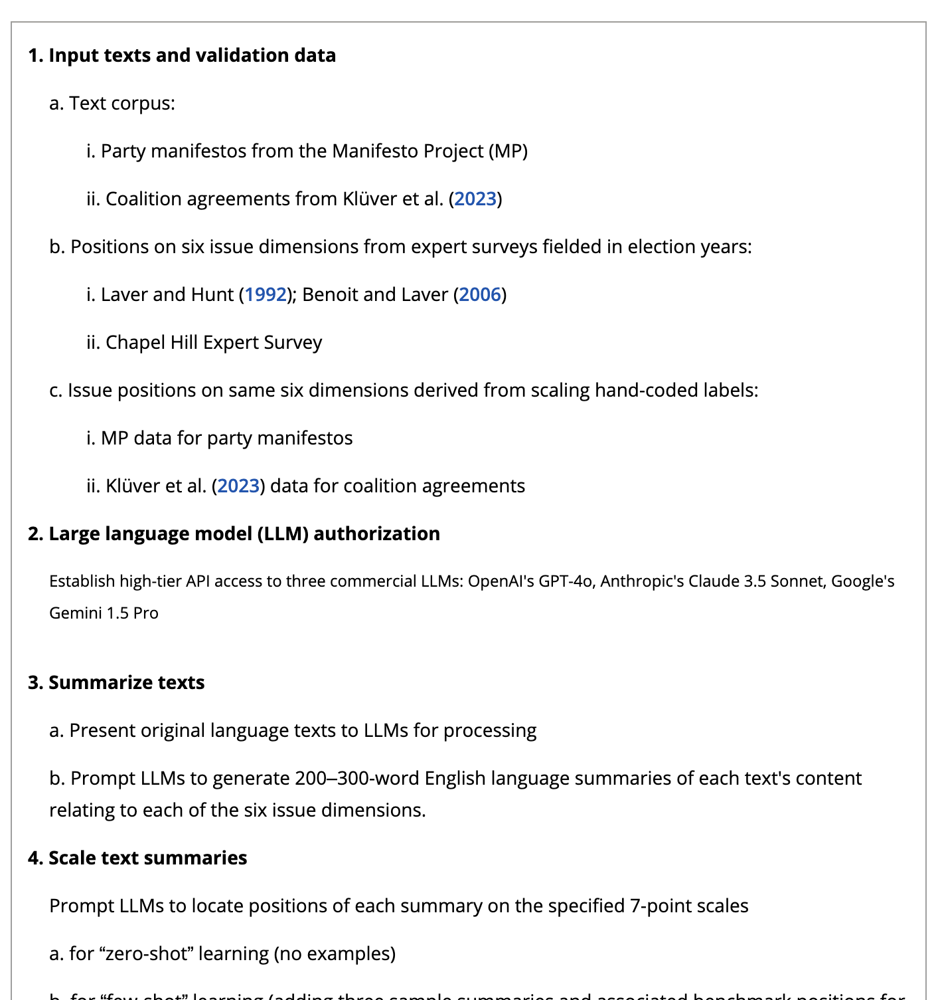
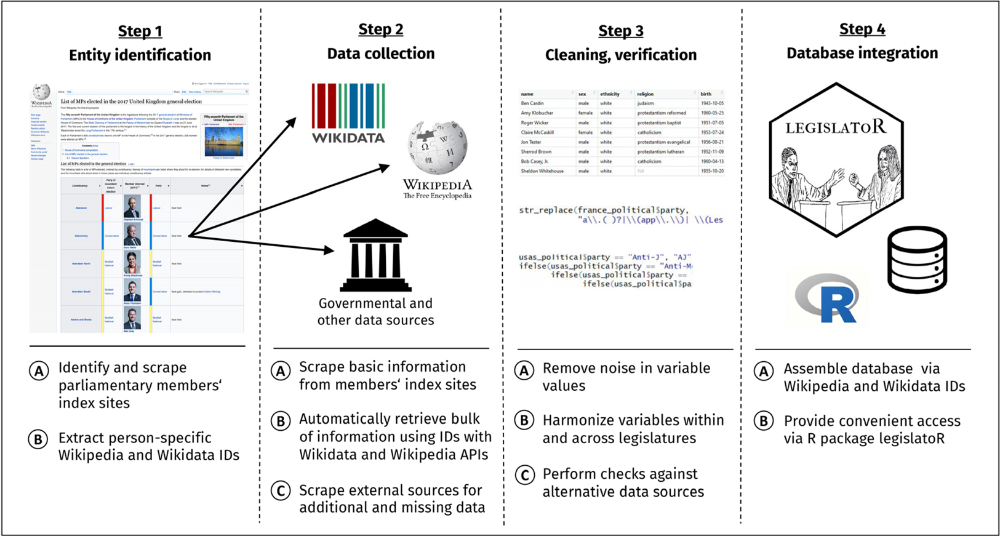
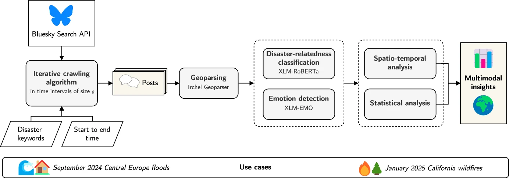
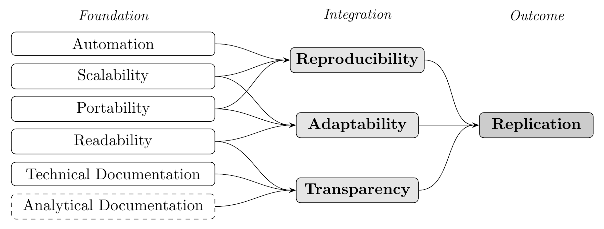
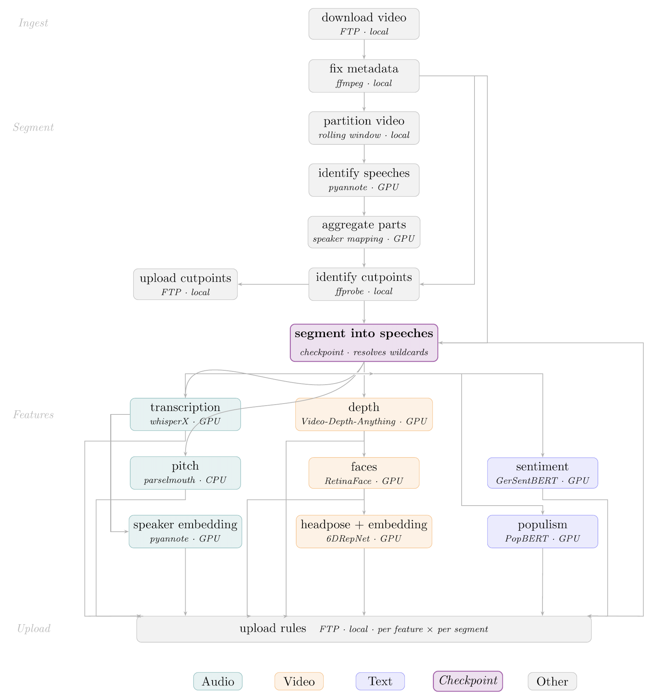
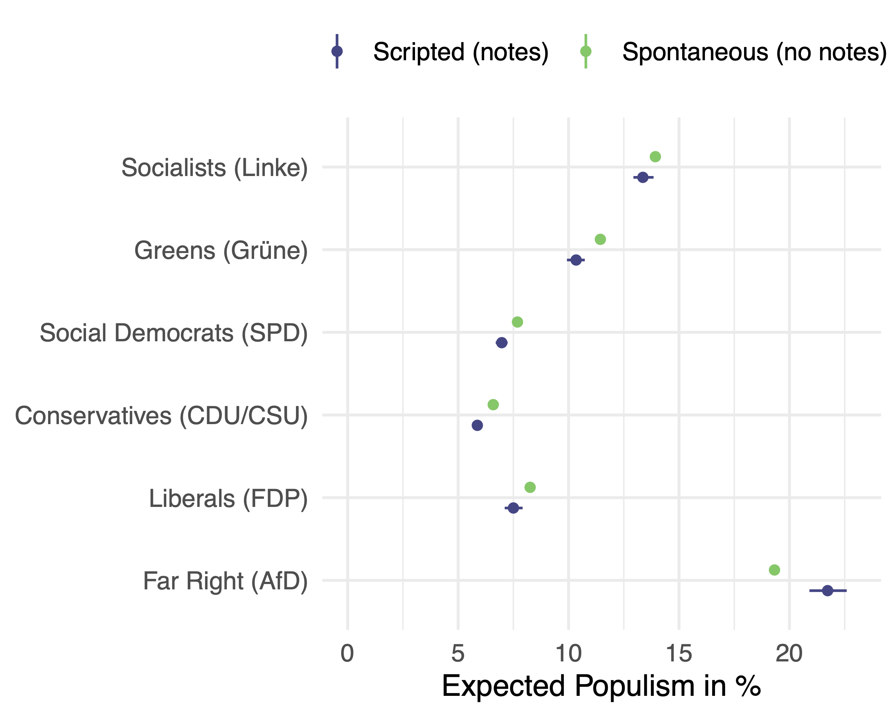

::: {.columns}
::: {.column width="50%"}

{hight=90%}
*(Benoit et al., 2026)*
:::
::: {.column width="50%"}
{width=100%}
*(Göbel and Munzert, 2018)*

{width=100%}

*(Hanny et al., 2025)*
:::
:::

---

## The Replication Crisis is an Infrastructure Crisis

CSS pipelines have grown:

- Large-n corpora: text, audio, image, video
- Multi-step processing chains involving different models and environments
- Workloads exceeding a single machine

::: {.fragment}
But replication infrastructure has not kept pace: mostly still a collection of standalone scripts run by hand.
:::
---

## Six Infrastructure Issues in Current Practice

```{=html}
<div style="display: grid; grid-template-columns: 1fr 1fr; gap: 1em; font-size: 1em;">

  <div style="border-left: 3px solid #2a7ab5; padding: 0.5em 0.8em; background: #f5f8fc;">
    <div style="font-weight: 700; color: #1a1a2e;">Automation</div>
    <div style="margin-top: 0.15em;">Scripts executed by hand, in mental order</div>
    <div style="margin-top: 0.2em; color: #888; font-size: .9em;">→ Stale outputs; execution errors go undetected</div>
  </div>

  <div style="border-left: 3px solid #2a7ab5; padding: 0.5em 0.8em; background: #f5f8fc;">
    <div style="font-weight: 700; color: #1a1a2e;">Scalability</div>
    <div style="margin-top: 0.15em;">Code designed to fit a laptop</div>
    <div style="margin-top: 0.2em; color: #888; font-size: .9em;">→ Computationally intensive questions stay unanswered</div>
  </div>

  <div style="border-left: 3px solid #2a7ab5; padding: 0.5em 0.8em; background: #f5f8fc;">
    <div style="font-weight: 700; color: #1a1a2e;">Portability</div>
    <div style="margin-top: 0.15em;">Hardcoded paths, undeclared dependencies</div>
    <div style="margin-top: 0.2em; color: #888; font-size: .9em;">→ Code that works on one machine breaks silently on another</div>
  </div>

  <div style="border-left: 3px solid #2a7ab5; padding: 0.5em 0.8em; background: #f5f8fc;">
    <div style="font-weight: 700; color: #1a1a2e;">Readability</div>
    <div style="margin-top: 0.15em;">Scripts written for one-time use</div>
    <div style="margin-top: 0.2em; color: #888; font-size: .9em;">→ Replication is nominal; reuse is impossible</div>
  </div>

  <div style="border-left: 3px solid #2a7ab5; padding: 0.5em 0.8em; background: #f5f8fc;">
    <div style="font-weight: 700; color: #1a1a2e;">Technical Documentation</div>
    <div style="margin-top: 0.15em;">No automatic logging</div>
    <div style="margin-top: 0.2em; color: #888; font-size: .9em;">→ Results cannot be traced to conditions of production</div>
  </div>

  <div style="border-left: 3px solid #2a7ab5; padding: 0.5em 0.8em; background: #f5f8fc;">
    <div style="font-weight: 700; color: #1a1a2e;">Analytical Documentation</div>
    <div style="margin-top: 0.15em;">Decisions undocumented in code</div>
    <div style="margin-top: 0.2em; color: #888; font-size: .9em;">→ Researcher degrees of freedom remain invisible</div>
  </div>

</div>
```

::: {.fragment style="margin-top: 0.8em; border-top: 1px solid #ddd; padding-top: 0.5em;"}
Together, these issues prevent what *King (1995)* demands: sufficient information for a third party to understand, evaluate, and extend the work.
:::

---

## {background-color="#1a1a2e" .center}

```{=html}
<div style="display:flex;flex-direction:column;align-items:center;justify-content:center;height:100%;color:white;gap:0.8em;">
  <div style="font-size:2.8em;font-weight:700;">Workflow Management Systems</div>
  <div style="width:50px;height:3px;background:#2a7ab5;border-radius:2px;"></div>
  <div style="font-size:1.5em;color:#aac4e0;">A structural solution to an infrastructure problem</div>
</div>
```

---

## Workflow Management Systems (WMS) Offer a Structural Solution

::: {style="margin-bottom: 1.5em;"}
A WMS represents a pipeline as an explicit **DAG**: each step declares its **inputs** and **outputs** while the system enforces order, detects stale outputs, and manages environments automatically.
:::

::: {.fragment .columns}
::: {.column width="40%"}
**Why Snakemake?**

- Python-based DSL (low barrier for CSS researchers)
- Fastest end-to-end execution among WMS benchmarks *(Larsonneur et al., 2018)*
- 75% of public Snakemake repos have less than 23 rules *(Pohl et al., 2024)*
:::

::: {.fragment .column width="60%"}
```{.python code-line-numbers="1-22"}
    ...
        json=SPEECHES / "{parliament}" / "{filename}" / "features" /
          "{base}_{segment}_depth.json",
    script: "scripts/generate_video_feature_depth.py"

rule generate_video_feature_faces:
    input:
        video=SPEECHES / "{parliament}" / "{filename}" / "videos" /
          "{base}_{segment}.mp4",
        depth_json=SPEECHES / "{parliament}" / "{filename}" / "features" /
          "{base}_{segment}_depth.json",
    output:
        json=SPEECHES / "{parliament}" / "{filename}" / "features" /
          "{base}_{segment}_faces.json",
    script: "scripts/generate_video_feature_faces.py"

rule generate_video_feature_headpose:
    input:
        faces_json=SPEECHES / "{parliament}" / "{filename}" / "features" /
          "{base}_{segment}_faces.json",
    ...
```

:::
:::

---

## Framework: From Six Properties to Full Replication<br>(Adapted from *Mölder et al. (2021)*)

::: {style="text-align: center;"}
{width=100% .nostretch}
:::

---

## {background-color="#1a1a2e" .center}

```{=html}
<div style="display:flex;flex-direction:column;align-items:center;justify-content:center;height:100%;color:white;gap:0.8em;">
  <div style="font-size:2.8em;font-weight:700;">How WMS Addresses the Six Issues</div>
  <div style="width:50px;height:3px;background:#2a7ab5;border-radius:2px;"></div>
  <div style="font-size:1.5em;color:#aac4e0;">Reproducibility | Adaptability | Transparency</div>
</div>
```

---

## Reproducibility: Automation & Portability in Practice

::: {.columns}
::: {.fragment .column width="50%"}
**Automation**

- Snakemake infers the full DAG from rule definitions
- Execution order is enforced by the software, not the researcher's memory
- A change to any upstream step invalidates stale downstream outputs (automatic rerun)
:::
::: {.fragment .column width="50%"}
**Portability**

- `conda:` directive pins the exact software environment per rule
- `singularity:/apptainer:` enables full container support
- Hardcoded paths replaced by Snakemake's wildcard system
:::
:::

::: {.fragment style="margin-top: 1em; font-size: 30px"}
::: {.callout-warning}
## The two most common causes of replication failure *(Eubank 2016)*
Wrong execution order & Environment/version inconsistency
:::

Snakemake resolves both issues structurally, not through researcher discipline. Without additional documentation effort, a Snakemake project automatically satisfies the REP framework *(Stodden et al., 2016)*.
:::

---

## Adaptability: Scale Without Porting

Without accessible scaling infrastructure, studies are designed to fit a laptop. In turn, this removes the incentive to invest in scaling infrastructure.

With Snakemake, the same workflow definition runs on different environments with a single config change:

- A local laptop
- A SLURM/PBS HPC cluster
- Google Cloud
- AWS, Azure

::: {.fragment style="font-size: 30px"}

| Without WMSS | With WMS |
|---|---|
| Prototype locally, manually port to HPC | Same file, one config |
| Ad-hoc Virtual Machine deployment | Portable, parallelised, reproducible |
| Studies limited by laptop RAM | Much more resources due to HPC portability |

:::

---

## Transparency: Documentation Without Effort

::: {.columns}
::: {.column width="50%"}
**Technical Documentation** (automatic)

- Every rule execution is logged: timestamps, input files, output files, software versions, exit codes
- LLM pipelines: model version, temperature, system prompt, and prompt template are encoded in workflow definition or pinned environment files
- No separate README can fall out of sync with a workflow file *that is the workflow*

:::
::: {.fragment .column width="50%"}
**Analytical Documentation** (structured)

- `config.yaml` provides a machine-readable location for all analytical parameters
- Model specifications, sample restrictions, exclusion criteria, operationalisation choices, robustness variants
- Each parameter = a named, versioned, version-controlled entry
- Running an alternative specification = changing one config value; both remain auditable
:::
:::

---

## {background-color="#1a1a2e" .center}

```{=html}
<div style="display:flex;flex-direction:column;align-items:center;justify-content:center;height:100%;color:white;gap:0.8em;">
  <div style="font-size:2.8em;font-weight:700;">Snakemake in Practice</div>
  <div style="width:50px;height:3px;background:#2a7ab5;border-radius:2px;"></div>
  <div style="font-size:1.5em;color:#aac4e0;">30,000 hours of parliamentary video across 17 German parliaments</div>
</div>
```

---

## Application: A Snakemake Pipeline for 30,000 Hours of Parliamentary Video

::: {.columns}
::: {.column width="45%"}
**The corpus**

- All available speeches from the German Bundestag and all 16 state parliaments
- &gt;30,000 hours (>20TB) of footage
- ~170,000 individual uncut video files
- Heterogeneous across parliaments: format, segmentation, and recording quality vary widely

::: {.fragment}
**Performance with Snakemake**

~4 min 20 sec end-to-end for 1 hour of raw video
:::
:::
::: {.fragment .column width="55%"}
{width=80% fig-alt="Rule-level DAG of the Snakemake pipeline showing ingest, segment, feature extraction (audio: transcription, pitch, speaker embedding; video: depth, faces, headpose; text: sentiment, populism), and upload stages"}
:::
:::

---

## Application: Is Populist Rhetoric Spontaneous or Scripted?

::: {.columns}
::: {.column width="42%"}
**Research question**

Does populist rhetoric emerge organically in unscripted speech, or is it prepared in advance?

Gaze direction reveals delivery mode: looking at notes = scripted; looking at audience = more *spontaneous*.

::: {.fragment}

**Key findings**

- **Mainstream parties**: *spontaneous* → more populist language
- **Far-Right AfD reverses**: scripted → more populist language (populism is a deliberate strategy)
:::
:::
::: {.column width="57%"}
{width=100%}
:::
:::

---

## Conclusion

WMS are an implicit implementation of the replication framework the discipline has long dicussed:

- **Automation** removes human error and undocumented execution order
- **Scalability** breaks the infrastructural constraint that keeps CSS artificially smaller
- **Portability** reduces environment inconsistency across machines and over time
- **Readability** makes pipelines comprehensible enough to be reviewed, verified, and built upon
- **Technical Documentation** creates a provenance record automatically
- **Analytical Documentation** makes the garden of forking paths visible and auditable

Together, they fulfil what *King (1995)* demanded: sufficient information for a third party to understand, evaluate, and extend the work.

---

## {.center background-color="#1a1a2e"}

```{=html}
<div style="display: flex; flex-direction: column; align-items: center; justify-content: center; height: 100%; color: white; gap: 1.2em;">

  <div style="font-size: 2em; font-weight: 700; letter-spacing: 0.03em;">Introducing Workflow Management to Computational Social Science</div>

  <div style="width: 60px; height: 3px; background: #2a7ab5; border-radius: 2px;"></div>

  <div style="display: flex; gap: 5em; margin-top: 0.4em; font-size: 0.95em;">
    <div style="text-align: center;">
      <div style="font-weight: 600; font-size: 1.05em;">Andreas Kuepfer</div>
      <div style="color: #aac4e0; margin-top: 0.2em;">TU Darmstadt</div>
      <div style="margin-top: 1em; font-size: 0.85em; color: #cce0f5; font-family: monospace;">andreas.kuepfer@tu-darmstadt.de</div>
      <div style="margin-top: 0.5em; font-size: 0.85em; color: #cce0f5; font-family: monospace;">andreaskuepfer.github.io</div>
      <div style="margin-top: 0.5em; font-size: 0.85em; color: #cce0f5; font-family: monospace;">ankuepfer.bsky.social</div>
    </div>
    <div style="text-align: center;">
      <div style="font-weight: 600; font-size: 1.05em;">Christian Arnold</div>
      <div style="color: #aac4e0; margin-top: 0.2em;">University of Birmingham</div>
      <div style="margin-top: 1em; font-size: 0.85em; color: #cce0f5; font-family: monospace;">c.arnold.2@bham.ac.uk</div>
      <div style="margin-top: 0.5em; font-size: 0.85em; color: #cce0f5; font-family: monospace;">chrisguarnold.github.io/</div>
      <div style="margin-top: 0.5em; font-size: 0.85em; color: #cce0f5; font-family: monospace;">chrisguarnold.bsky.social</div>
    </div>
  </div>

  <div style="margin-top: 0.6em; font-size: 0.78em; color: #7aa8cc; letter-spacing: 0.05em; text-transform: uppercase;">
    8th Annual COMPTEXT Conference | April 23–25, 2026 | University of Birmingham, UK
  </div>

</div>
```


```{=html}
<script>
function updateFooter() {
  const footer = document.querySelector('.reveal > .footer');
  if (!footer) return;
  const current = Reveal.getCurrentSlide();
  const isFirst = current && current.id === 'title-slide';
  const isLast = Reveal.isLastSlide();
  footer.style.display = (isFirst || isLast) ? 'none' : '';
}
Reveal.on('ready', updateFooter);
Reveal.on('slidechanged', updateFooter);
</script>
```
