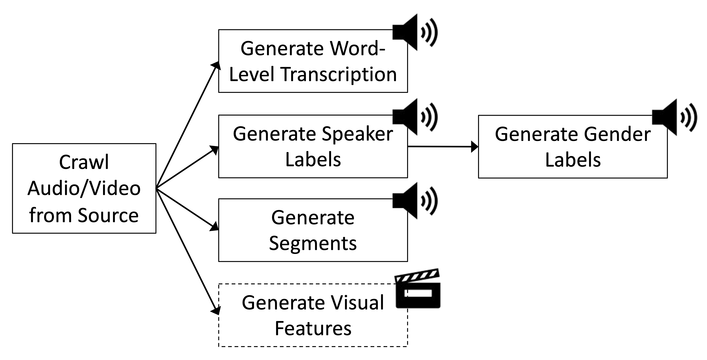
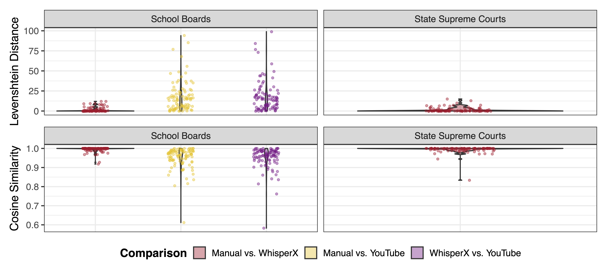
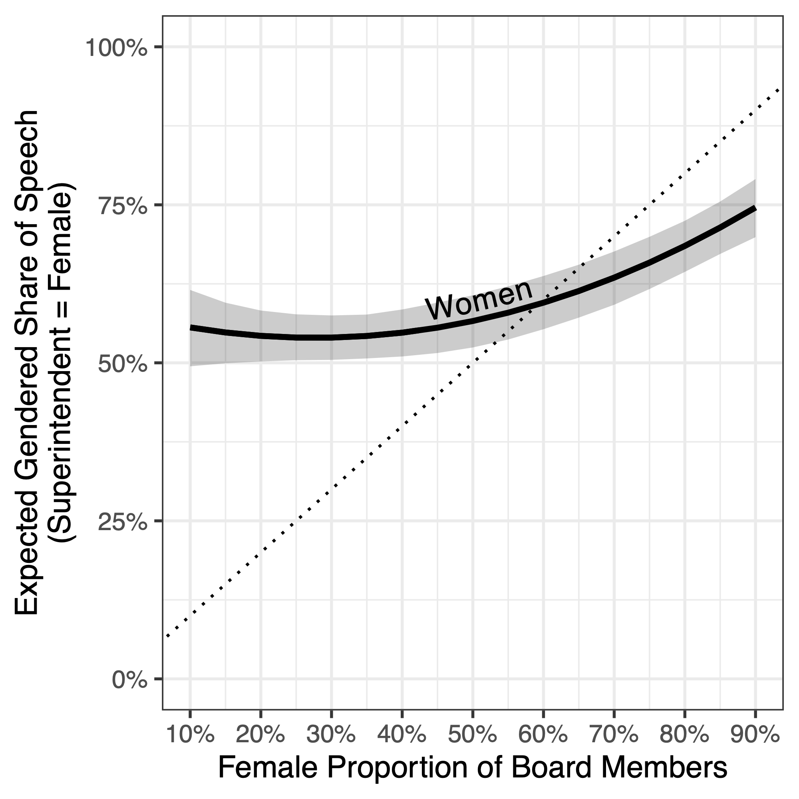
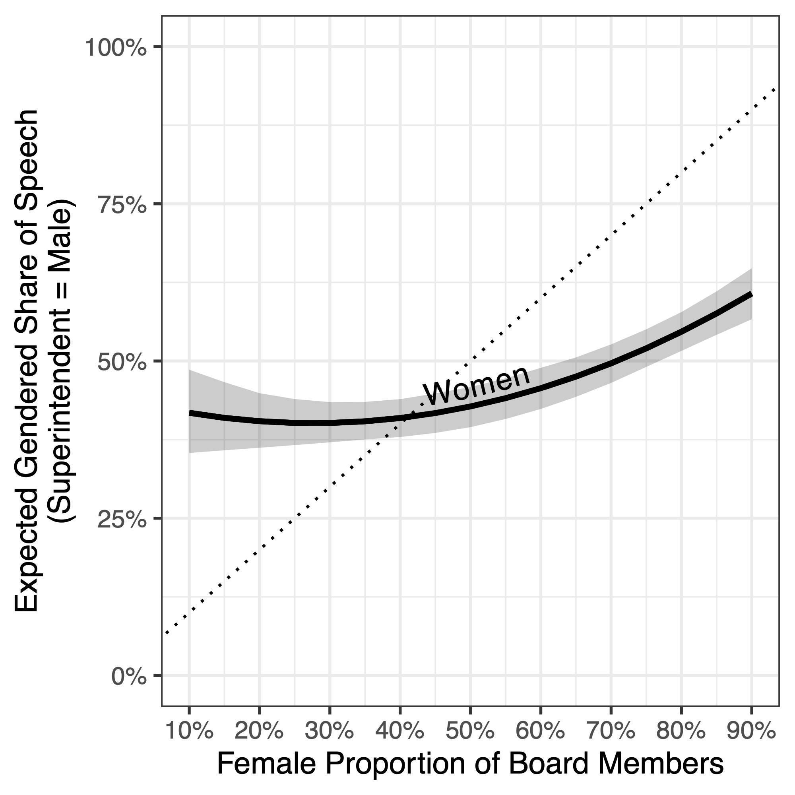

::: {style="text-align:center;"}
{height=10em}
:::

::: {.fragment style="text-align:center"}
{height=15em}
:::
---

## The Research Gap in Subnational Multimodal Political Communication

- Political scientists now regularly use audio, video, and text data to study deliberation, representation, and emotion
- But: existing work focuses largely on highly professionalized settings like national legislatures

::: {.fragment}
- Many institutions are forced by law to make their work transparent
- Making video recordings of political processes available is often less effort than carefully post-processing and structuring what was discussed
:::
---

## {background-color="#1a1a2e" .center}

```{=html}
<div style="display:flex;flex-direction:column;align-items:center;justify-content:center;height:100%;color:white;gap:0.8em;">
  <div style="font-size:2.8em;font-weight:700;">Studying Video Recordings of Subnational Politics</div>
  <div style="width:50px;height:3px;background:#2a7ab5;border-radius:2px;"></div>
  <div style="font-size:1.5em;color:#aac4e0;">Challenges and Opportunities</div>
</div>
```

---

## Challenges and Opportunities

::: {.columns}
::: {.column width="50%"}
::: {.fragment}
#### Subnational Policymaking is Hard to Study

- Data from subnational meetings is often not standardised
- no uniform reporting standard for meeting records, roll call votes, etc.
- Fortunately, full archives of video recordings of meetings are widely available on the institutions' websites or YouTube

:::
:::
::: {.column width="50%"}
::: {.fragment}
#### Useful Variation in Subnational Meetings

- Distributed within a country (easy to correlate with regional factors)
- Lots of over-time variation across institutions and within (e.g., school board composition,
  composition of justices)
- Many different actors (e.g., citizens during public comments or appellants in state supreme
  court meetings)
:::
:::
:::

---

## Our Study

What kinds of data can be extracted from political meetings videos, and how can these data be substantively used in political science research?

::: {.fragment}
::: {.columns}
::: {.column width="35%"}
- Transcriptions
- Speaker diarization and gender classification
- Segment identification
:::
::: {.column width="65%"}
{height=90%}
:::
:::
:::

---

## Our Cases


::: {.columns}
::: {.column width="40%"}
```{=html}

  <div style="border-left: 3px solid #2a7ab5; padding: 0.6em 0.9em; background: #f5f8fc;">
    <div style="font-weight: 700; color: #1a1a2e; font-size: 1.05em; margin-bottom: 0.4em;">US School Board Meetings</div>
    <ul style="margin: 0; padding-left: 1.2em;">
      <li>1,000+ hours of video (YouTube)</li>
      <li>30 School Boards (564 meetings)</li>
      <li>Focus on variation in board gender composition</li>
    </ul>
  </div>

```
:::
::: {.column width="60%"}
<div style="display: flex; align-items: center; height: 100%;">
  
</div>
:::

::: {.fragment}
::: {.columns}
::: {.column width="40%"}

```{=html}

  <div style="border-left: 3px solid #2a7ab5; padding: 0.6em 0.9em; background: #f5f8fc; margin-top:1em">
    <div style="font-weight: 700; color: #1a1a2e; font-size: 1.05em; margin-bottom: 0.4em;">US State Supreme Court Arguments</div>
    <ul style="margin: 0; padding-left: 1.2em;">
      <li>1,500+ hours of video/audio (Court websites)</li>
      <li>5 State Supreme Courts</li>
      <li>Data spanning 1996–2025</li>
    </ul>
  </div>

```
:::
::: {.column width="60%"}
<div style="display: flex; align-items: center; height: 100%;">
  
</div>
:::
:::
:::

:::

---

## The Relevance of Subnational Meetings

::: {.columns}
::: {.column width="50%"}
**US School Boards**

- Oversee and develop curriculum of schools
- Set local tax rates (partially)
- Approve capital projects
- Negotiations for union contracts
:::
::: {.column width="50%"}
::: {.fragment}
**US State Supreme Courts**

- Ultimate authority over state constitutional interpretation
- Can invalidate state laws and executive actions
- Decide high-stakes election and redistricting cases
:::
:::
:::

---

## {background-color="#1a1a2e" .center}

```{=html}
<div style="display:flex;flex-direction:column;align-items:center;justify-content:center;height:100%;color:white;gap:0.8em;">
  <div style="font-size:2.8em;font-weight:700;">Validating the Pipeline</div>
  <div style="width:50px;height:3px;background:#2a7ab5;border-radius:2px;"></div>
  <div style="font-size:1.5em;color:#aac4e0;">Transcription | Diarization | Gender | Segments</div>
</div>
```

---

## Transcription: What is Being Spoken?

Challenge: Local politics often does not produce any transcription but summarisation minutes or subtitles from YouTube.

Our Approach: *WhisperX*  *(Bain et al. 2023)* transcribes on word-level with timestamps (1h of video = 85 seconds).

::: {.fragment style="text-align: center;"}
{height=15em}

Word Error Rate: 0.009 (School Boards); 0.010 (State Supreme Courts)
:::
---

## Diarization: Who Speaks When?

Challenge: Local politics often does not have fixed speaker order or meta information about speakers.

Our Approach: *pyannote* *(Bredin 2023)* detects and aligns word-level speaker changes (1h of video = 30 seconds).

::: {.fragment style="text-align: center;"}
```{=html}
<table style="font-size: 0.7em; border-collapse: collapse; width: 100%; margin-top: 0.6em;">
  <thead>
    <tr>
      <th style="background-color: #2a7ab5; color: white; padding: 5px 10px; text-align: left;">Word</th>
      <th style="background-color: #2a7ab5; color: white; padding: 5px 10px; text-align: left;">Start</th>
      <th style="background-color: #2a7ab5; color: white; padding: 5px 10px; text-align: left;">End</th>
      <th style="background-color: #2a7ab5; color: white; padding: 5px 10px; text-align: left;">Speaker ID</th>
      <th style="background-color: #2a7ab5; color: white; padding: 5px 10px; text-align: left;">Speaker Change</th>
    </tr>
  </thead>
  <tbody>
    <tr><td style="padding:4px 10px;border-bottom:1px solid #ddd;">we</td><td style="padding:4px 10px;border-bottom:1px solid #ddd;">1460.49</td><td style="padding:4px 10px;border-bottom:1px solid #ddd;">1460.61</td><td style="padding:4px 10px;border-bottom:1px solid #ddd;">speaker_b061</td><td style="padding:4px 10px;border-bottom:1px solid #ddd;">0</td></tr>
    <tr style="background:#f5f7fa;"><td style="padding:4px 10px;border-bottom:1px solid #ddd;">have</td><td style="padding:4px 10px;border-bottom:1px solid #ddd;">1460.67</td><td style="padding:4px 10px;border-bottom:1px solid #ddd;">1460.87</td><td style="padding:4px 10px;border-bottom:1px solid #ddd;">speaker_b061</td><td style="padding:4px 10px;border-bottom:1px solid #ddd;">0</td></tr>
    <tr><td style="padding:4px 10px;border-bottom:1px solid #ddd;">the</td><td style="padding:4px 10px;border-bottom:1px solid #ddd;">1460.93</td><td style="padding:4px 10px;border-bottom:1px solid #ddd;">1461.09</td><td style="padding:4px 10px;border-bottom:1px solid #ddd;">speaker_b061</td><td style="padding:4px 10px;border-bottom:1px solid #ddd;">0</td></tr>
    <tr style="background:#f5f7fa;"><td style="padding:4px 10px;border-bottom:1px solid #ddd;">superintendent</td><td style="padding:4px 10px;border-bottom:1px solid #ddd;">1461.17</td><td style="padding:4px 10px;border-bottom:1px solid #ddd;">1461.73</td><td style="padding:4px 10px;border-bottom:1px solid #ddd;">speaker_b061</td><td style="padding:4px 10px;border-bottom:1px solid #ddd;">0</td></tr>
    <tr><td style="padding:4px 10px;border-bottom:1px solid #ddd;">report.</td><td style="padding:4px 10px;border-bottom:1px solid #ddd;">1461.77</td><td style="padding:4px 10px;border-bottom:1px solid #ddd;">1463.18</td><td style="padding:4px 10px;border-bottom:1px solid #ddd;">speaker_b061</td><td style="padding:4px 10px;border-bottom:1px solid #ddd;">0</td></tr>
    <tr style="background:#ffd700; font-weight:bold;"><td style="padding:4px 10px;border-bottom:1px solid #ddd;">Because</td><td style="padding:4px 10px;border-bottom:1px solid #ddd;">1463.88</td><td style="padding:4px 10px;border-bottom:1px solid #ddd;">1464.14</td><td style="padding:4px 10px;border-bottom:1px solid #ddd;">speaker_a69c</td><td style="padding:4px 10px;border-bottom:1px solid #ddd;">1</td></tr>
    <tr><td style="padding:4px 10px;border-bottom:1px solid #ddd;">we</td><td style="padding:4px 10px;border-bottom:1px solid #ddd;">1464.18</td><td style="padding:4px 10px;border-bottom:1px solid #ddd;">1464.28</td><td style="padding:4px 10px;border-bottom:1px solid #ddd;">speaker_a69c</td><td style="padding:4px 10px;border-bottom:1px solid #ddd;">0</td></tr>
    <tr style="background:#f5f7fa;"><td style="padding:4px 10px;border-bottom:1px solid #ddd;">met</td><td style="padding:4px 10px;border-bottom:1px solid #ddd;">1464.34</td><td style="padding:4px 10px;border-bottom:1px solid #ddd;">1464.46</td><td style="padding:4px 10px;border-bottom:1px solid #ddd;">speaker_a69c</td><td style="padding:4px 10px;border-bottom:1px solid #ddd;">0</td></tr>
    <tr><td style="padding:4px 10px;">last</td><td style="padding:4px 10px;">1464.52</td><td style="padding:4px 10px;">1464.70</td><td style="padding:4px 10px;">speaker_a69c</td><td style="padding:4px 10px;">0</td></tr>
  </tbody>
</table>
```

95.74% of predicted speaker changes accurate (DER: 3.38% (State Supreme Courts), 3.79% (School Boards))
:::
---

## What are Gendered Shares of Speech?

Challenge: Because of lacking meta information, we often do not know about gendered dynamics in local
political meetings.

Our Approach: A fine-tuned *wav2vec* model assigns gender labels to audio segments (1h of video = 10 seconds).

::: {.fragment}

```{=html}
<div style="display: grid; grid-template-columns: 1fr 1fr; gap: 1em; margin-top: 0.8em;">
  <div style="border-left: 3px solid #2a7ab5; padding: 0.6em 0.9em; background: #f5f8fc;">
    <div style="font-weight: 700; color: #1a1a2e; margin-bottom: 0.3em;">Validation</div>
    250 randomly selected segments validated against manual visual coding: 98.37% correctly classified.
  </div>
<div style="border-left: 3px solid #2a7ab5; padding: 0.6em 0.9em; background: #f5f8fc;">
  <div style="font-weight: 700; color: #1a1a2e; margin-bottom: 0.3em;">Measurement note</div>
  We infer <em>perceived</em> gender from vocal cues using a binary classifier. This reflects how speakers are heard (but not their self-identified gender) and cannot capture non-binary identities.
</div>
</div>
```
:::

---

## What Agenda Items Were Discussed and for How Long?

Challenge: Even though some institutions publish an agenda, we don't know what is actually discussed
during particular agenda items.

Our Approach: Open-weight LLM *LLaMA 3.1 (8B)* generates agenda items and aligns them with start/end timestamps.

```{=html}
<table style="font-size: 0.65em; border-collapse: collapse; width: 100%; margin-top: 0.6em;">
  <thead>
    <tr>
      <th style="background-color: #2a7ab5; color: white; padding: 5px 10px; text-align: left;">Item name</th>
      <th style="background-color: #2a7ab5; color: white; padding: 5px 10px; text-align: left;">Meeting minutes</th>
      <th style="background-color: #2a7ab5; color: white; padding: 5px 10px; text-align: left;">Zero shot</th>
      <th style="background-color: #2a7ab5; color: white; padding: 5px 10px; text-align: left;">One shot</th>
    </tr>
  </thead>
  <tbody>
    <tr><td style="padding:4px 10px;border-bottom:1px solid #ddd;">Front matter</td><td style="padding:4px 10px;border-bottom:1px solid #ddd;"></td><td style="padding:4px 10px;border-bottom:1px solid #ddd;">0:07:23</td><td style="padding:4px 10px;border-bottom:1px solid #ddd;">0:07:23</td></tr>
    <tr style="background:#f5f7fa;"><td style="padding:4px 10px;border-bottom:1px solid #ddd;">Call to order</td><td style="padding:4px 10px;border-bottom:1px solid #ddd;">0:00:00</td><td style="padding:4px 10px;border-bottom:1px solid #ddd;">0:07:23</td><td style="padding:4px 10px;border-bottom:1px solid #ddd;">0:07:23</td></tr>
    <tr><td style="padding:4px 10px;border-bottom:1px solid #ddd;">Pledge of allegiance</td><td style="padding:4px 10px;border-bottom:1px solid #ddd;">0:00:22</td><td style="padding:4px 10px;border-bottom:1px solid #ddd;"></td><td style="padding:4px 10px;border-bottom:1px solid #ddd;">0:07:39</td></tr>
    <tr style="background:#f5f7fa;"><td style="padding:4px 10px;border-bottom:1px solid #ddd;">Approval of minutes</td><td style="padding:4px 10px;border-bottom:1px solid #ddd;">0:01:16</td><td style="padding:4px 10px;border-bottom:1px solid #ddd;">0:08:33</td><td style="padding:4px 10px;border-bottom:1px solid #ddd;">0:08:33</td></tr>
    <tr><td style="padding:4px 10px;border-bottom:1px solid #ddd;">Communications</td><td style="padding:4px 10px;border-bottom:1px solid #ddd;">0:01:39</td><td style="padding:4px 10px;border-bottom:1px solid #ddd;">0:08:56</td><td style="padding:4px 10px;border-bottom:1px solid #ddd;">0:08:56</td></tr>
    <tr style="background:#ffd700; font-weight:bold;"><td style="padding:4px 10px;border-bottom:1px solid #ddd;">Public comment/public hearing on 2024–25 budget</td><td style="padding:4px 10px;border-bottom:1px solid #ddd;">0:16:47</td><td style="padding:4px 10px;border-bottom:1px solid #ddd;">0:24:04</td><td style="padding:4px 10px;border-bottom:1px solid #ddd;">0:24:04</td></tr>
    <tr><td style="padding:4px 10px;border-bottom:1px solid #ddd;">Consent items</td><td style="padding:4px 10px;border-bottom:1px solid #ddd;">0:16:58</td><td style="padding:4px 10px;border-bottom:1px solid #ddd;">0:24:15</td><td style="padding:4px 10px;border-bottom:1px solid #ddd;">0:24:15</td></tr>
    <tr style="background:#f5f7fa;"><td style="padding:4px 10px;border-bottom:1px solid #ddd;">Action items</td><td style="padding:4px 10px;border-bottom:1px solid #ddd;">0:17:30</td><td style="padding:4px 10px;border-bottom:1px solid #ddd;">0:24:47</td><td style="padding:4px 10px;border-bottom:1px solid #ddd;">0:24:47</td></tr>
    <tr><td style="padding:4px 10px;border-bottom:1px solid #ddd;">BOE planning/new business</td><td style="padding:4px 10px;border-bottom:1px solid #ddd;">0:55:47</td><td style="padding:4px 10px;border-bottom:1px solid #ddd;">1:03:17</td><td style="padding:4px 10px;border-bottom:1px solid #ddd;"></td></tr>
    <tr style="background:#f5f7fa;"><td style="padding:4px 10px;">Adjournment</td><td style="padding:4px 10px;">0:58:47</td><td style="padding:4px 10px;"></td><td style="padding:4px 10px;">1:03:43</td></tr>
  </tbody>
</table>
```

---

## {background-color="#1a1a2e" .center}

```{=html}
<div style="display:flex;flex-direction:column;align-items:center;justify-content:center;height:100%;color:white;gap:0.8em;">
  <div style="font-size:2.8em;font-weight:700;">Application</div>
  <div style="width:50px;height:3px;background:#2a7ab5;border-radius:2px;"></div>
  <div style="font-size:1.5em;color:#aac4e0;">Women's Representation and Speaking Time in School Boards</div>
</div>
```

---

## Application: Women's Representation and Speaking Time

Does the gender composition of school boards translate into gendered speaking time during meetings?

- Gender of board members and superintendent hand-coded at the year level
- DV: Share of speech by women; Predictor: proportion of female board members (quadratic relationship expected)
- Separate estimates for female vs. male superintendents

::: {.fragment style="text-align: center;"}
{height=13em}
{height=13em}
:::

---

## Application: Key Findings

::: {.fragment}
```{=html}
<div style="border-left: 3px solid #2a7ab5; padding: 0.5em 0.9em; background: #f5f8fc; margin-bottom: 0.7em;">
  <strong>Non-linear "critical mass" effect</strong><br>
  Women's speech share increases sharply once female board membership exceeds ~50%.
</div>
```
:::

::: {.fragment}
```{=html}
<div style="border-left: 3px solid #2a7ab5; padding: 0.5em 0.9em; background: #f5f8fc; margin-bottom: 0.7em;">
  <strong>Superintendent gender matters</strong><br>
  Boards with a female superintendent show substantially higher women's speech share at every level of board composition.
</div>
```
:::

::: {.fragment}
```{=html}
<div style="border-left: 3px solid #2a7ab5; padding: 0.5em 0.9em; background: #f5f8fc; margin-bottom: 0.7em;">
  <strong>Staff and clerks explain the floor</strong><br>
  Even in heavily male-dominated boards, women's speech share stays ~50% — reflecting administrative staff, clerks, and report authors, who are disproportionately women.
</div>
```
:::

::: {.fragment style="font-size: 0.85em; color: #555; margin-top: 0.4em;"}
*Contrast with Karpowitz & Mendelberg (2014): our pipeline captures all speakers in the room, not just elected board members.*
:::

---

## Conclusion

- Subnational multimodal political communication remains limited by data access and processing challenges
- Our open-source pipeline transforms raw subnational political meeting into transcripts, diarized speech, gender labels, and segment timestamps (~3 min/hour on a single GPU)
- Applicable on a wide range of political settings
- Validated on 1,000+ hrs of school board meetings (30 boards) and 1,500+ hrs of state supreme court arguments (5 states, 1996–2025)
- Application: non-linear critical mass effect; superintendent gender matters; staff composition shapes women's speaking time at scale

---

## {.center background-color="#1a1a2e"}

```{=html}
<div style="display: flex; flex-direction: column; align-items: center; justify-content: center; height: 100%; color: white; gap: 1.2em;">

  <div style="font-size: 1.8em; font-weight: 700; letter-spacing: 0.02em; text-align: center;">
    A Pipeline for Extracting Data from Videos of Complex Events
  </div>

  <div style="width: 60px; height: 3px; background: #2a7ab5; border-radius: 2px;"></div>

  <div style="display: flex; gap: 2em; margin-top: 0.4em; font-size: 0.9em;">
    <div style="text-align: center;">
      <div style="font-weight: 300; font-size: 1.05em;">Mirya R. Holman</div>
      <div style="color: #aac4e0; margin-top: 0.2em;">University of Houston</div>
    </div>
    <div style="text-align: center;">
      <div style="font-weight: 900; font-size: 1.05em;">Andreas Kuepfer</div>
      <div style="font-weight: 900; color: #aac4e0; margin-top: 0.2em;">TU Darmstadt</div>
      <div style="margin-top: 0.8em; font-size: 0.85em; color: #cce0f5; font-family: monospace;">andreas.kuepfer@tu-darmstadt.de</div>
      <div style="margin-top: 0.3em; font-size: 0.85em; color: #cce0f5; font-family: monospace;">andreaskuepfer.github.io</div>
      <div style="margin-top: 0.3em; font-size: 0.85em; color: #cce0f5; font-family: monospace;">ankuepfer.bsky.social</div>
    </div>
    <div style="text-align: center;">
      <div style="font-weight: 300; font-size: 1.05em;">Tyler Simko</div>
      <div style="color: #aac4e0; margin-top: 0.2em;">University of Michigan</div>
    </div>
  </div>

</div>
```

```{=html}
<script>
function updateFooter() {
  const footer = document.querySelector('.reveal > .footer');
  if (!footer) return;
  const current = Reveal.getCurrentSlide();
  const isFirst = current && current.id === 'title-slide';
  const isLast = Reveal.isLastSlide();
  footer.style.display = (isFirst || isLast) ? 'none' : '';
}
Reveal.on('ready', updateFooter);
Reveal.on('slidechanged', updateFooter);
</script>
```
