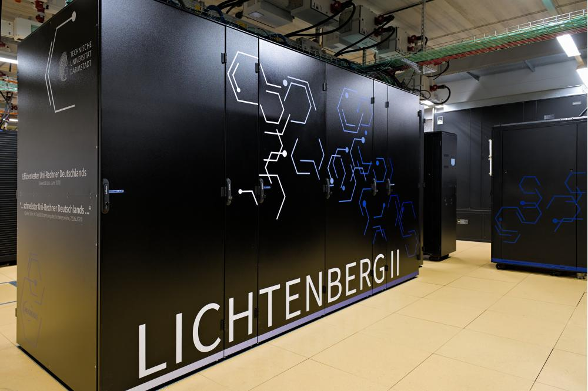
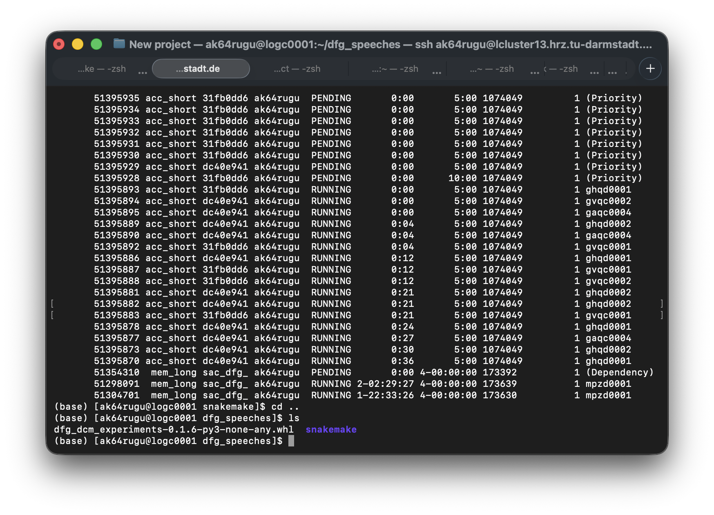
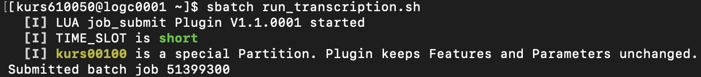
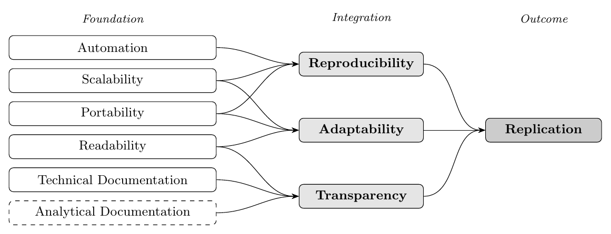
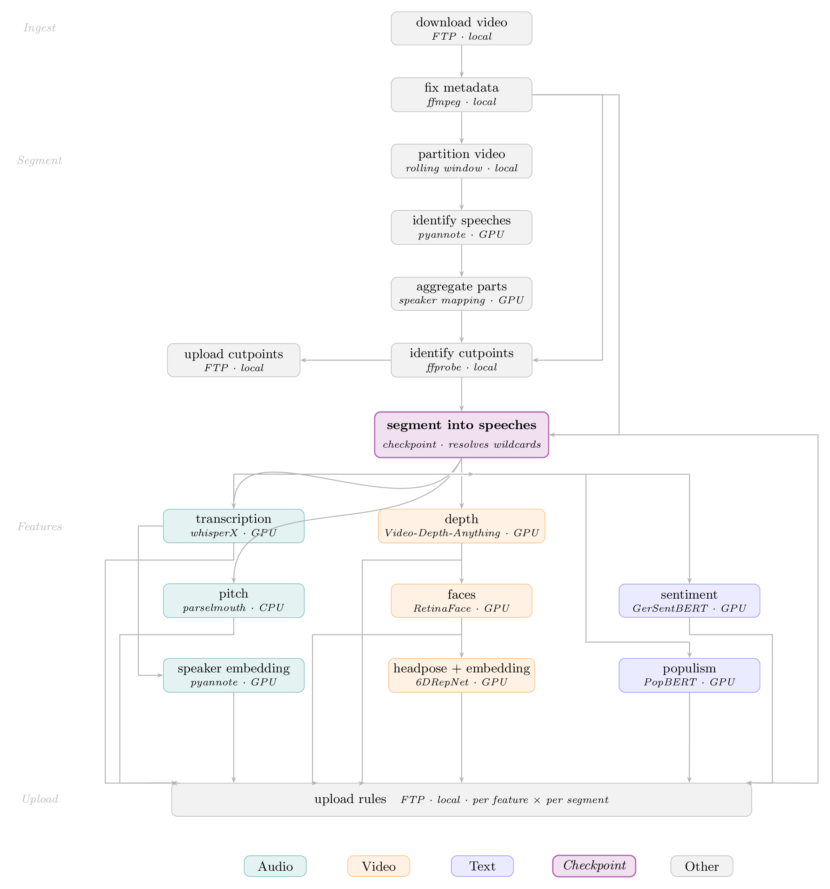

---
format:
  revealjs:
    theme: [default, custom.scss]
    slide-number: false
    progress: true
    transition: slide
    background-transition: fade
    highlight-style: github
    code-line-numbers: true
    code-overflow: scroll
    fig-align: center
    footer: "From Desktop to Cluster | COMPTEXT 2026 Workshop"
    controls: false
    menu: false
    width: 1280
    height: 720
execute:
  echo: true
  eval: false
---

# {.title-slide background="linear-gradient(135deg, #1a1a2e 0%, #16213e 50%, #0f3460 100%)"}

<div style="padding: 2em 4em; color: white; display: flex; flex-direction: column; justify-content: center; height: 100%;">

<div style="font-size: 1em; text-transform: uppercase; letter-spacing: 0.15em; color: #93c5fd; font-weight: 600; margin-bottom: 0.5em;">COMPTEXT 2026 Workshop</div>

<h1 style="color: white; font-size: 1.7em; font-weight: 800; line-height: 1.2; margin: 0 0 0.4em 0;">From Desktop to Cluster</h1>

<div style="color: #93c5fd; font-size: 1.2em; font-weight: 500; margin-bottom: 2em; max-width: 700px; line-height: 1.4;">Scaling Computational Social Science with High-Performance Computing</div>

<div style="color: #e2e8f0; font-size: 0.95em; font-weight: 600; margin-bottom: 0.25em;">Andreas Kuepfer</div>
<div style="color: #94a3b8; font-size: 0.95em; margin-bottom: 1em;">TU Darmstadt</div>
<div style="color: #94a3b8; font-size: 0.95em;">Thursday, April 23, 2026 &nbsp;·&nbsp;  University of Birmingham</div>

</div>

---

## {background-color="#0f172a" .no-line}

<div style="display: flex; align-items: center; height: 85%; gap: 1em; padding: 0 0.5em;">
<div style="display: flex; flex-direction: column; gap: 0.6em; flex: 0 0 38%;">
<div class="fragment fade-in"></div>
<div class="fragment fade-in"></div>
</div>
<div class="fragment fade-in" style="display: flex; flex-direction: column; align-items: center; justify-content: center; flex: 0 0 7%; gap: 0.5em;">
<div style="display: flex; align-items: center; width: 100%;"><div style="height: 3px; flex: 1; background: linear-gradient(to right, #1e3a5f, #93c5fd); border-radius: 2px;"></div><div style="width: 0; height: 0; border-top: 9px solid transparent; border-bottom: 9px solid transparent; border-left: 15px solid #93c5fd; flex-shrink: 0;"></div></div>
</div>
<div class="fragment fade-in" style="flex: 1; display: flex; flex-direction: column; gap: 0.4em;">
<div style="display: grid; grid-template-columns: repeat(3, 1fr); grid-template-rows: repeat(2, 1fr); gap: 0.5em;">
<div style="position: relative; border-radius: 8px; overflow: hidden; border: 2px solid #1e3a5f;"><div style="position: absolute; bottom: 0; left: 0; right: 0; background: rgba(15,23,42,0.85); color: #93c5fd; font-size: 0.45em; text-align: center; padding: 0.3em; font-weight: 600; text-transform: uppercase; letter-spacing: 0.05em;">Social Media</div></div>
<div style="position: relative; border-radius: 8px; overflow: hidden; border: 2px solid #1e3a5f;"><div style="position: absolute; bottom: 0; left: 0; right: 0; background: rgba(15,23,42,0.85); color: #93c5fd; font-size: 0.45em; text-align: center; padding: 0.3em; font-weight: 600; text-transform: uppercase; letter-spacing: 0.05em;">TV Broadcasts</div></div>
<div style="position: relative; border-radius: 8px; overflow: hidden; border: 2px solid #1e3a5f;"><div style="position: absolute; bottom: 0; left: 0; right: 0; background: rgba(15,23,42,0.85); color: #93c5fd; font-size: 0.45em; text-align: center; padding: 0.3em; font-weight: 600; text-transform: uppercase; letter-spacing: 0.05em;">Parliamentary Debates</div></div>
<div style="position: relative; border-radius: 8px; overflow: hidden; border: 2px solid #1e3a5f;"><div style="position: absolute; bottom: 0; left: 0; right: 0; background: rgba(15,23,42,0.85); color: #93c5fd; font-size: 0.45em; text-align: center; padding: 0.3em; font-weight: 600; text-transform: uppercase; letter-spacing: 0.05em;">News Archives</div></div>
<div style="position: relative; border-radius: 8px; overflow: hidden; border: 2px solid #1e3a5f;"><div style="position: absolute; bottom: 0; left: 0; right: 0; background: rgba(15,23,42,0.85); color: #93c5fd; font-size: 0.45em; text-align: center; padding: 0.3em; font-weight: 600; text-transform: uppercase; letter-spacing: 0.05em;">Political Meetings</div></div>
<div style="position: relative; border-radius: 8px; overflow: hidden; border: 2px solid #1e3a5f;"><div style="position: absolute; bottom: 0; left: 0; right: 0; background: rgba(15,23,42,0.85); color: #93c5fd; font-size: 0.45em; text-align: center; padding: 0.3em; font-weight: 600; text-transform: uppercase; letter-spacing: 0.05em;">Court Meetings</div></div>
</div>
<div style="text-align: center; color: #93c5fd; font-size: 1.5em; letter-spacing: 0.2em;">···</div>
</div>
</div>

---

## Complex Methods in Computational Social Science to Address this Data

<div style="margin-top: 0.4em;">
<div style="display: grid; grid-template-columns: repeat(3, 1fr); gap: 0.5em;">

<div style="background: #0f172a; border: 1px solid #1e3a5f; border-radius: 6px; padding: 0.6em;">
<div style="color: #93c5fd; font-size: 0.65em; font-weight: 700; margin-bottom: 0.3em;">Natural Language Processing</div>
<div style="color: #94a3b8; font-size: 0.55em; line-height: 1.4;">Text classification · Topic modelling · LLM annotation</div>
</div>

<div style="background: #0f172a; border: 1px solid #1e3a5f; border-radius: 6px; padding: 0.6em;">
<div style="color: #93c5fd; font-size: 0.65em; font-weight: 700; margin-bottom: 0.3em;">Computer Vision & Audio</div>
<div style="color: #94a3b8; font-size: 0.55em; line-height: 1.4;">Image classification · ASR · Speaker diarisation</div>
</div>

<div style="background: #0f172a; border: 1px solid #1e3a5f; border-radius: 6px; padding: 0.6em;">
<div style="color: #93c5fd; font-size: 0.65em; font-weight: 700; margin-bottom: 0.3em;">Network Analysis</div>
<div style="color: #94a3b8; font-size: 0.55em; line-height: 1.4;">Graph processing · Community detection · Diffusion</div>
</div>

<div style="background: #0f172a; border: 1px solid #1e3a5f; border-radius: 6px; padding: 0.6em;">
<div style="color: #93c5fd; font-size: 0.65em; font-weight: 700; margin-bottom: 0.3em;">Causal Inference</div>
<div style="color: #94a3b8; font-size: 0.55em; line-height: 1.4;">Bootstrapping · Simulation · Large-scale matching</div>
</div>

<div style="background: #0f172a; border: 1px solid #1e3a5f; border-radius: 6px; padding: 0.6em;">
<div style="color: #93c5fd; font-size: 0.65em; font-weight: 700; margin-bottom: 0.3em;">Agent-Based Modelling</div>
<div style="color: #94a3b8; font-size: 0.55em; line-height: 1.4;">Large population simulations · Sensitivity analyses</div>
</div>

<div style="background: #0f172a; border: 1px solid #1e3a5f; border-radius: 6px; padding: 0.6em;">
<div style="color: #93c5fd; font-size: 0.65em; font-weight: 700; margin-bottom: 0.3em;">Relevant to All</div>
<div style="color: #94a3b8; font-size: 0.55em; line-height: 1.4;">Hyperparameter tuning · Cross-validation · Monte Carlo</div>
</div>
</div>
</div>

---

## {background="linear-gradient(135deg, #0f172a 0%, #1e1b4b 50%, #0f3460 100%)"}

<div style="display: flex; flex-direction: column; justify-content: center; height: 100%; padding: 1.5em 2em; color: white;">

<h2 style="color: white; font-size: 1.4em; font-weight: 800; line-height: 1.3; margin: 0 0 0.8em 0;">How can we analyze rich, complex data and apply computationally demanding methods at scale?</h2>

<div class="fragment" style="display: grid; grid-template-columns: 1fr 1fr; gap: 0em; align-items: center; margin-top: 0em;">

<div style="text-align: center;">
<div style="display: inline-flex; flex-direction: column; align-items: center; gap: 0.3em; background: #1e3a5f; border: 2px solid #93c5fd; border-radius: 12px; padding: 0.8em 2em;">
<span style="color: #93c5fd; font-size: 2em; font-weight: 900;">High-Performance Computing</span>
</div>
</div>

<div style="text-align: center;">

<div style="color: #64748b; font-size: 0.55em; margin-top: 0.4em;">Lichtenberg II · TU Darmstadt</div>
</div>

</div>

</div>

---

## What You Will Take Away

::: {.columns}
::: {.column .fragment width="50%"}

**Conceptual understanding**

- Why desktop computing hits a wall
- CPU vs. GPU: what they're good for
- What an HPC cluster actually looks like

:::
::: {.column .fragment width="50%"}

**Practical skills**

- Connect to a remote cluster via SSH
- Navigate Linux filesystems
- Write, submit, and monitor batch jobs (SLURM)

:::
::: {.column .fragment width="50%"}

**Research workflow thinking**

- Structure reproducible pipelines
- Understand resource trade-offs
- Know when (and when *not*) to use HPC

:::
:::

::: {.box-blue .fragment style="position: absolute; bottom: 1.5em; left: 2.5em; right: 2.5em; font-size: 1.1em; padding: 1em 1.5em;"}
**No prior HPC experience needed:** Basic familiarity with R or Python and the terminal is helpful but not required.
:::

---

## Workshop at a Glance

<div style="display: flex; gap: 2em; align-items: flex-start; margin-top: 0.5em;">

<div style="flex: 1;">

| Block | Topic | |
|-------|-------|---|
| **Block 1** | Why HPC? Motivation and big picture | <span style="background:#16213e;color:white;font-size:0.65em;padding:2px 7px;border-radius:4px;">💬 Explore/Discussion</span> |
| **Block 2** | HPC architecture: nodes, cores, memory | |
| **Block 3** | Connecting and navigating an HPC cluster | <span style="background:#16213e;color:white;font-size:0.65em;padding:2px 7px;border-radius:4px;">✏️ Hands-on Exercise</span> |
| *Break* | | |
| **Block 4** | Job schedulers: writing and submitting jobs | <span style="background:#16213e;color:white;font-size:0.65em;padding:2px 7px;border-radius:4px;">✏️ Hands-on Exercise</span> |
| **Block 5** | Monitoring, debugging and best practices | <span style="background:#16213e;color:white;font-size:0.65em;padding:2px 7px;border-radius:4px;">✏️ Hands-on Exercise</span> |
| **Block 6** | Workflow managers and outlook | <span style="background:#16213e;color:white;font-size:0.65em;padding:2px 7px;border-radius:4px;">🎬 Live Demo</span> |

: {.striped tbl-colwidths="[18,62,30]"}

</div>

<div style="width: 410px; flex-shrink: 0; text-align: center; padding-top: 0.5em;">
<a href="https://github.com/andreaskuepfer/css-introduction-hpc" target="_blank">

</a>
<div style="color: #94a3b8; font-size: 0.45em; margin-top: 0.4em; line-height: 1.4;">Workshop Material<br>github.com/andreaskuepfer/<br>css-introduction-hpc</div>
</div>

</div>

# Block 1: Why HPC? {background-color="#1e3a5f" style="color: white;"}

::: {style="color: #93c5fd; font-size: 0.75em; margin-top: 0.5em;"}
Desktop limits · CPU vs. GPU · When HPC is (and isn't) worth it
:::

## The Desktop Computing Wall

::: {.columns}
::: {.column .fragment width="55%"}

You've hit the wall when…

- Your script has been running for 3 days and you need results tomorrow
- Loading the full dataset exhausts your RAM
- Training 100 model variants would take days sequentially
- Your laptop fan sounds afraid

::: {.box-orange .fragment style="position: absolute; bottom: 1.5em; left: 2.5em; right: 2.5em; font-size: 1.1em; padding: 1em 1.5em;"}
**The typical research laptop:**
8-16 GB RAM · 8-16 CPU cores · no GPU · shared with your browser, RStudio, Zoom, and Spotify
:::

:::
::: {.column .fragment width="45%"}

**Common CSS bottlenecks**

| Task | Bottleneck |
|------|-----------|
| Large corpus NLP | RAM + CPU |
| Transformer fine-tuning | GPU memory |
| Image + text fusion (CLIP-style) | GPU memory |
| Audio / video transcription at scale | CPU + GPU |
| Web scraping + parsing | I/O + CPU |

:::
:::

---

## What Is High-Performance Computing?

::: {.columns}
::: {.column .fragment width="60%"}

HPC = **many computers working together**, managed as a shared infrastructure

- **Cluster**: a collection of nodes connected by a fast network
- **Node**: one individual computer (server) in the cluster
- **Job**: a unit of computation you submit for execution
- **Scheduler**: the software that allocates resources and queues jobs

::: {.box-blue .fragment style="position: absolute; bottom: 1.5em; left: 2.5em; right: 2.5em; font-size: 1.1em; padding: 1em 1.5em;"}
Think of HPC like a **printing service**: you submit a job, it gets queued, a machine picks it up, and you collect the result, but you don't sit at the printer.
:::

:::
::: {.column .fragment width="40%"}

<pre style="background: none; border: none; box-shadow: none; font-family: monospace; font-size: 0.7em; line-height: 1.5;">╔══════════════════════╗
║   Login / Head Node  ║  ← you SSH here
╠══════════════════════╣
║   Job Scheduler      ║  ← SLURM
╠══════════════════════╣
║  Compute  Compute    ║
║  Node 1   Node 2     ║
║  Node 3   Node 4 ... ║
╠══════════════════════╣
║   Shared Storage     ║
╚══════════════════════╝
</pre>

:::
:::

---

## CPU vs. GPU: The Core Distinction

::: {.columns}
::: {.column .fragment width="50%" data-fragment-index="1"}

### CPU — Central Processing Unit

- A **few powerful cores** (4–128)
- Excellent at **sequential**, complex tasks
- Best for: data wrangling, statistical models

:::
::: {.column .fragment width="50%" data-fragment-index="3"}

### GPU — Graphics Processing Unit

- **Thousands of small cores**
- Excellent at **massively parallel** tasks (same operation on many values)
- Originally designed for graphics rendering
- Best for: deep learning, transformer models, large matrix operations

:::
:::

::: {.box-blue .fragment .current-visible style="position: absolute; bottom: 1.5em; left: 2.5em; right: 2.5em; font-size: 1.1em; padding: 1em 1.5em;" data-fragment-index="2"}
**Use CPU for:**
`lm()`, `tidytext`, web scraping, simulation, most basic ML in scikit-learn
:::

::: {.box-blue .fragment style="position: absolute; bottom: 1.5em; left: 2.5em; right: 2.5em; font-size: 1.1em; padding: 1em 1.5em;" data-fragment-index="4"}
**Use GPU for:**
BERT fine-tuning, image classification, large language models, torch/tensorflow training
:::

---

## When to Use HPC in CSS Research

::: {.columns}
::: {.column .fragment width="48%"}

**Good candidates for HPC**

- Processing **millions of documents** (corpora, social media archives, audiovisual data)
- Fine-tuning or running **large language models** (BERT, GPT-class)
- **Bootstrapping** / permutation tests with many iterations
- **Grid search** over model hyperparameters
- **Agent-based simulations** at scale
- Large **network analysis** (graphs with millions of nodes)

:::
::: {.column .fragment width="48%"}

**Might not need HPC**

- Analysis fits in laptop RAM (< ~8 GB data)
- Single model run completes in < 4 hour
- Highly interactive / exploratory analysis
- Output depends on human review at each step

::: {.box-green .fragment style="bottom: 1.5em; left: 2.5em; right: 2.5em; font-size: 1.1em; padding: 1em 1.5em;" data-fragment-index="2"}
**Rule of thumb:** If you wish you could run your script 10× faster or with 10× more data HPC is worth exploring.
:::

:::
:::

---

## Exercise 1 (5-10 Minutes): Find Your HPC {background-color="#16213e" style="color: white;"}

<div style="margin-top: 0.8em; display: grid; grid-template-columns: repeat(3, 1fr); gap: 1em;">

<div style="background: #0f172a; border: 1px solid #1e3a5f; border-radius: 8px; padding: 0.9em;">
<div style="color: #93c5fd; font-size: 0.8em; font-weight: 700; margin-bottom: 0.5em;">Institutional</div>
<div style="color: #94a3b8; font-size: 0.7em; line-height: 1.5;">Does your university or research institute run its own cluster? Check your IT or research computing website.</div>
</div>

<div style="background: #0f172a; border: 1px solid #1e3a5f; border-radius: 8px; padding: 0.9em;">
<div style="color: #93c5fd; font-size: 0.8em; font-weight: 700; margin-bottom: 0.5em;">Regional / Consortium</div>
<div style="color: #94a3b8; font-size: 0.7em; line-height: 1.5;">Regional alliances may offer shared resources: e.g. de.NBI / NFDI (Germany), SNIC (Sweden), PRACE / EuroHPC (Europe).</div>
</div>

<div style="background: #0f172a; border: 1px solid #1e3a5f; border-radius: 8px; padding: 0.9em;">
<div style="color: #93c5fd; font-size: 0.8em; font-weight: 700; margin-bottom: 0.5em;">National</div>
<div style="color: #94a3b8; font-size: 0.7em; line-height: 1.5;">Many countries have national HPC centres open to researchers: e.g. ARCHER2 (UK), NCI (Australia), ACCESS (USA), KISTI (South Korea).</div>
</div>

</div>

::: {.box-blue style="color: #1e293b; font-size: 1em;"}
**Task 1:** Search for HPC resources you might have access to. Note down what you find and how easy it seems to get access.
:::

::: {.box-blue style="color: #1e293b; font-size: 1em;"}
**Task 2**: With your neighbours, discuss what did you each find and how different are access routes across your institutions.

:::

---

## {background-color="#1a1a2e" style="color: white; text-align: center;"}

<div style="display: flex; gap: 2em; align-items: center; justify-content: center; height: 85%;">

<div style="text-align: center;">

<div style="color: #93c5fd; font-size: 0.7em; margin-top: 0.6em; font-weight: 600;">menti.com/al4phv55giz5</div>
</div>

<div style="position: relative; width: 280px; height: 160px; overflow: hidden; border-radius: 8px; flex-shrink: 0;">
<iframe sandbox='allow-popups allow-scripts allow-same-origin allow-presentation' allowfullscreen='true' allowtransparency='true' frameborder='0' src='https://www.mentimeter.com/app/presentation/alzc343jycpedaikbtrdmm7mwc2waz6g/embed' style='position: absolute; top: 0; left: 0; width: 100%; height: 100%;'></iframe>
</div>

</div>

---

## {background-color="#1a1a2e" style="color: white; text-align: center;"}

<div style="display: flex; gap: .5em; align-items: flex-start;">

<div style="flex: 1; position: relative; padding-bottom: 56.25%; padding-top: 35px; height: 0; overflow: hidden;">
<iframe sandbox='allow-popups allow-scripts allow-same-origin allow-presentation' allowfullscreen='true' allowtransparency='true' frameborder='0' height='315' src='https://www.mentimeter.com/app/presentation/alzc343jycpedaikbtrdmm7mwc2waz6g/embed' style='position: absolute; top: 0; left: 0; width: 95%; height: 80%;' width='420'></iframe>
</div>

<div style="width: 140px; flex-shrink: 0; text-align: center;">

<div style="color: #94a3b8; font-size: 0.5em; margin-top: 0.4em;">menti.com/al4phv55giz5</div>
</div>

</div>

# Block 2: HPC Architecture {background-color="#1e3a5f" style="color: white;"}

::: {style="color: #93c5fd; font-size: 0.75em; margin-top: 0.5em;"}
Nodes, cores and memory · Storage tiers · Software modules and environments
:::

## This Is What It Looks Like in Practice

{fig-align="center" width="90%"}

::: {style="color: #94a3b8; font-size: 0.75em; text-align: center; margin-top: 0.5em;"}
Logged in into TU Darmstadt's Lichtenberg cluster: jobs running, pending, and a Snakemake workflow directory
:::

## Anatomy of an HPC Cluster

<pre style="background: none; border: none; box-shadow: none; font-family: monospace; font-size: 0.7em; line-height: 1.5;">
                    You (SSH)
                        │
                ┌───────▼────────┐
                │  Login Node    │  — where you land, write code, submit jobs
                │  (head node)   │    DO NOT run heavy computation here
                └───────┬────────┘
          ┌─────────────┼────────────┐
          │             │            │
  ┌───────▼──────┐  ┌───▼──────┐  ┌──▼───────┐
  │ Compute Node │  │ GPU Node │  │ Fat Node │
  │ 32cores/128GB│  │ 8× A100  │  │ 2TB RAM  │
  └──────────────┘  └──────────┘  └──────────┘
          │             │             │
          └─────────────┼─────────────┘
                ┌───────▼────────┐
                │  Shared Storage│  — /home, /scratch, /project
                │  (e.g., NFS)   │
                └────────────────┘
</pre>

---

## Node Types and When to Use Them

| Node Type | Typical Resources | Best For |
|-----------|-------------------|----------|
| **Standard compute** | 32–128 cores, 256 GB RAM | Parallel R/Python jobs, NLP preprocessing |
| **High-memory** | 32–64 cores, 1–4 TB RAM | Very large datasets loaded into RAM |
| **GPU** | 4–8 GPUs (A100/H100), 40–80 GB VRAM each | Model training, inference at scale |
| **Login / head** | shared, limited | File editing, job submission *only* |

: {.striped}

::: {.box-orange .fragment style="position: absolute; bottom: 1.5em; left: 2.5em; right: 2.5em; font-size: 1.1em; padding: 1em 1.5em;"}
**Never run heavy computation on the login node:** You share these resources it with all other users.
:::

---

## Storage on HPC Systems

::: {.columns}
::: {.column .fragment width="55%"}

Most clusters have multiple storage tiers:

| Path | Purpose | Notes |
|------|---------|-------|
| `/home/<username>` | Personal files, scripts | Small quota (20-50 GB), backed up |
| `/scratch/<username>` | Temporary job I/O | Large (10-20 TB), **not** backed up, purged regularly |
| `/project/<groupname>` | Shared team data | Larger quota (1-5 TB), longer retention |

:::
::: {.column .fragment width="45%"}

**Best practices**

- Store **scripts and results** → `/home`
- Write **job output** → `/scratch`
- Keep **large raw data** → `/project` or `/scratch`
- **Copy results off** the cluster after jobs finish
- Never rely on `/scratch` long-term

::: {.box-orange .fragment style="position: absolute; bottom: 1.5em; left: 2.5em; right: 2.5em; font-size: 1.1em; padding: 1em 1.5em;"}
Scratch files are not backuped and often **auto-deleted** after 30-90 days.
:::

:::
:::

---

## Software on HPC: Environment Modules

HPC clusters use a **module system** to manage software versions:

```bash
# See what software is available
module avail

# Load a specific module
module load R/4.3.1
module load python/3.11
module load cuda/12.1

# See what you have loaded
module list

# Unload/reset
module unload R/4.3.1
module purge
```

::: {.box-blue style="font-size: 0.9em; margin-top: 0.8em;"}
**Modules are optional:** You can install and manage your own software (e.g. via Conda or pip) without ever loading a module. In practice, modules are mainly useful for system-level dependencies like CUDA drivers or MPI that are hard to install yourself.
:::

---

## Conda and Virtual Environments

For Python (and increasingly R), the package managers **Conda** or **venv** are preferred for reproducibility:

```bash
# Create a project environment
conda create -n css-project python=3.11

# Activate it
conda activate css-project

# Install packages
conda install -c conda-forge transformers torch pandas

# or: create from envrionment file
conda env create -f environment.yml

# (Optional) Export for reproducibility
conda env export > environment.yml
```

# Block 3: Connecting and Navigating {background-color="#1e3a5f" style="color: white;"}

::: {style="color: #93c5fd; font-size: 0.75em; margin-top: 0.5em;"}
SSH · Linux essentials · File transfer
:::

## Connecting via SSH

**SSH** (Secure Shell) is how you talk to a remote HPC cluster:

```bash
# Basic connection (sometimes with 2FA)
ssh username@lcluster15.hrz.tu-darmstadt.de

# With a specific identity file (SSH key)
ssh -i ~/.ssh/id_ed25519 <username>@lcluster15.hrz.tu-darmstadt.de
```

::: {.columns}
::: {.column .fragment width="50%"}

**Where to open SSH:**

::: {style="font-size: 0.88em;"}
**macOS**: open **Terminal** (built-in, no install needed)

**Windows**: open **PowerShell** or **Command Prompt** (sometimes **MobaXterm**)
(OpenSSH module is built into Windows 11, same commands as Mac)
:::

**Normal first time setup:**

1. Generate a key pair: `ssh-keygen -t ed25519`
2. Copy public key to cluster: `ssh-copy-id username@cluster`
3. Optionally add to `~/.ssh/config` for a shorter login command

:::
::: {.column .fragment width="50%"}

**`~/.ssh/config` shortcut:**

```
Host lichtenberg
    HostName lcluster15.hrz.tu-darmstadt.de
    User <username>
    IdentityFile ~/.ssh/id_ed25519
```

Then just: `ssh lichtenberg`

::: {.box-blue style="font-size: 1.1em; margin-top: 0.8em;"}
**Windows note:** key files live in `C:\Users\<User>\.ssh\`, use the same path syntax in `config`. No extra software is needed.
:::

:::
:::

---

## Essential Linux Commands

::: {.columns}
::: {.column .fragment width="50%"}

**Navigation**

```bash
pwd          # Where am I?
ls -lh       # List files (human-readable)
cd /scratch  # Change directory
cd ~         # Go home

mkdir results       # Create directory
cp file1 file2      # Copy
mv file1 dir/       # Move / rename
rm file1            # Delete (no undo!)
rm -r dir/          # Delete directory (no undo!)
```

:::
::: {.column .fragment width="50%"}

**Viewing and editing files**

```bash
cat file.txt         # Print file
less file.txt        # Page through file (q to quit)
head -n 20 file.txt  # First 20 lines
tail -n 20 file.txt  # Last 20 lines
nano script.R        # Simple text editor
```

::: {.box-blue}
**nano:** navigate with arrow keys · search with `Ctrl+W` · exit with `Ctrl+X` (confirm save with `Y`)
:::

**Permissions and disk**

```bash
chmod +x script.sh   # Make executable
du -sh *             # Disk use per item
df -h                # Free disk space
```

:::
:::

---

## Transferring Files

<div style="display: grid; grid-template-columns: 1fr; gap: 0.6em; margin-top: 0.5em;">

<div class="fragment">

**`scp`**: secure copy (simple)

```bash
# Upload file to cluster
scp data.csv <username>@lcluster15.hrz.tu-darmstadt.de:~/data/
# Download result from cluster
scp <username>@lcluster15.hrz.tu-darmstadt.de:~/results/out.csv .
# Upload entire folder
scp -r project/ <username>@lcluster15.hrz.tu-darmstadt.de:~/
```

</div>

<div class="fragment">

**`rsync`**: smarter sync (only transfers what changed)

```bash
# Upload, skip unchanged files
rsync -avz project/ <username>@lcluster15.hrz.tu-darmstadt.de:~/project/
# Download results folder
rsync -avz <username>@lcluster15.hrz.tu-darmstadt.de:~/results/ ./results/
# Dry run (see what would happen)
rsync -avzn project/ <username>@lcluster15.hrz.tu-darmstadt.de:~/project/
```

</div>

<div class="fragment">

**FileZilla**: alternative with user interface

::: {style="font-size: 0.85em;"}
A free, cross-platform SFTP client: drag and drop files between your local device and the cluster.
:::

</div>

</div>

---

## Keeping Sessions Alive: `tmux`

SSH connections drop. Use **`tmux`** to keep work running:

```bash
# Start a named session
tmux new -s mywork

# Detach from session (keeps running!)
Ctrl+b  then  d

# Re-attach later
tmux attach -t mywork

# List active sessions
tmux ls

# Kill session
tmux kill-session -t mywork
```

::: {.box-green .fragment style="font-size: 1.1em; margin-top: 0.8em;"}
**Workflow:** SSH into cluster > start tmux session > do work > detach > close laptop > reconnect anytime > re-attach
:::

---

## Exercise 2: One Video You Will Work With {background-color="#0f2d1f" style="color: white;"}


<div style="display: flex; justify-content: center;">

**`pres_debate_obama_romney.mp4`**
</div>


---

## Exercise 2 (15-20 Minutes): Connecting and Uploading (1/2) {background-color="#0f2d1f" style="color: white;"}

::: {.columns}
::: {.column .fragment width="50%"}

**Task 1: Log in and explore**

::: {style="font-size: 0.85em; margin-bottom: 0.3em;"}
Before login: download your private key (📝)

**macOS:** open Terminal &nbsp;|&nbsp; **Windows:** open PowerShell / MobaXterm
:::

```bash
ssh -i <local/path/to/keyfile> \
<username>@lcluster<nodeID📝>.hrz.tu-darmstadt.de
pwd && ls -lh          # Where are you?
df -h ~                # Home quota
module avail           # Available software
module load python/3.11
module list
```

- What is your home directory path?
- How much quota do you have in your `/home`?

**Task 2: Copy script**

```bash
bash ../copy_files_1.sh
```
:::
::: {.column .fragment width="50%"}

**Task 3: Get the provided `pres_debate_obama_romney.mp4`**

*Option 1*: Download video file (📝)

Upload from your **local machine** (either `scp` or `rsync`):

```bash
scp -i <local/path/to/key> \
  pres_debate_obama_romney.mp4 \
  <username>@lcluster<nodeID📝>.hrz.tu-darmstadt.de:~/
rsync -avz \
  -e "ssh -i <local/path/to/keyfile>" \
  pres_debate_obama_romney.mp4 \
  <username>@lcluster<nodeID📝>.hrz.tu-darmstadt.de:~/
```

Verify on the cluster:
```bash
ls -lh ~/pres_debate_obama_romney.mp4
```

*Option 2*: Copy directly from HPC

```bash
cp ../pres_debate_obama_romney.mp4 .
```
:::
:::

---

## Exercise 2 (15-20 Minutes): Running Scripts (2/2) {background-color="#0f2d1f" style="color: white;"}

**Task 4: Write a plain bash script**

Integrate the provided `transcription.py`:

```python
import os
import whisperx
from whisperx.diarize import DiarizationPipeline
from tqdm import tqdm
import torch

video_file = "pres_debate_obama_romney.mp4"
device = os.environ.get("DEVICE", "cpu")
# ...
```

Create `transcription.sh` (using `nano transcription.sh`), a plain bash script that:

1. Starts with `#!/bin/bash` | 2. Runs: `python transcription.py`

::: {.box-green style="font-size: 1.1em; margin-top: 0.8em; color: black;"}
Run it with `bash transcription.sh` -> What happens?
:::

---

## {background-color="#0f172a" style="color: white; text-align: center;"}

<div style="margin-top: 1.2em;">
<p style="font-size: 2em; font-weight: 700; color: #f8fafc; letter-spacing: 0.02em;">Coffee Break</p>
<p style="font-size: 0.9em; color: #94a3b8; margin-top: 0.2em; margin-bottom: 1.6em;">Back in 15 minutes</p>

<p style="font-size: 0.65em; text-transform: uppercase; letter-spacing: 0.1em; color: #93c5fd; margin-bottom: 0.6em;">Did you know?</p>

<div id="fact-text-1" style="font-size: 0.9em; color: #cbd5e1; max-width: 680px; margin: 0 auto; min-height: 3em; line-height: 1.6; transition: opacity 0.4s;"></div>
<div id="fact-source-1" style="font-size: 0.5em; color: #475569; margin-top: 0.5em; transition: opacity 0.4s;"></div>

<div id="fact-dots-1" style="margin-top: 1em;"></div>
</div>

<script>
(function() {
  var facts = [
    { text: "As of November 2024, the world's fastest supercomputer is El Capitan at Lawrence Livermore National Laboratory, USA. It achieves 1.74 quintillion calculations per second which is over 40% faster than its predecessor Frontier.", source: "TOP500 List, top500.org (Nov 2024)" },
    { text: "100% of the world's top 500 supercomputers run Linux, the same OS you just SSH'd into.", source: "TOP500 List, top500.org" },
    { text: "SLURM, the job scheduler used in this workshop, manages resources at thousands of universities and national labs worldwide.", source: "SchedMD, schedmd.com" },
    { text: "An NVIDIA H100 GPU has 16,896 CUDA cores. A typical laptop GPU has around 2,000.", source: "NVIDIA H100 Tensor Core GPU Datasheet, nvidia.com" },
    { text: "A modern HPC GPU node can carry up to 8 H100 GPUs with 80 GB of memory each, which results in 640 GB of GPU memory on a single node.", source: "NVIDIA DGX H100 System Datasheet, nvidia.com" },
    { text: "HPC storage systems often operate at petabyte scale. 1 petabyte equals 1,000 terabytes, enough to store roughly 500 billion pages of text.", source: "Oak Ridge Leadership Computing Facility, olcf.ornl.gov (petabyte scale); page estimate derived from ~2 KB per page" },
    { text: "The first Beowulf cluster was built in 1994 from 16 commodity PCs connected by ethernet.", source: "Becker et al. (1995), NASA Center for Computational Sciences" },
    { text: "El Capitan, the world's fastest supercomputer, consumes around 29.6 megawatts which is enough to power roughly 20,000 homes. Cooling and energy use are now a primary design constraint for HPC.", source: "Lawrence Livermore National Laboratory, llnl.gov" },
    { text: "The NVIDIA H100 delivers 3.35 terabytes of memory bandwidth per second and carries up to 80 GB of HBM3 memory. A typical research laptop manages around 50–80 GB/s.", source: "NVIDIA H100 Tensor Core GPU Datasheet, nvidia.com" },
    { text: "The term 'supercomputer' was first used in 1929, referring to a custom tabulating machine built for Columbia University.", source: "IEEE Annals of the History of Computing" },
    { text: "A single NVIDIA H100 GPU costs around $30,000–$40,000. A full DGX H100 server with 8 GPUs runs close to $400,000 — which is why shared HPC access matters so much for researchers.", source: "NVIDIA partner pricing (2023–2024); Reuters / Bloomberg reporting" },
    { text: "Running one NVIDIA H100 GPU for a full year produces roughly 2 tonnes of CO2 which is about the same as driving 12,000 km in a petrol car.", source: "NVIDIA H100 Datasheet (700 W TDP); European Environment Agency, eea.europa.eu" }
  ];
  var idx = 0;

  function init() {
    var textEl = document.getElementById('fact-text-1');
    var srcEl  = document.getElementById('fact-source-1');
    var dotsEl = document.getElementById('fact-dots-1');
    if (!textEl || !dotsEl) return;

    facts.forEach(function(_, i) {
      var dot = document.createElement('span');
      dot.style.cssText = 'display:inline-block;width:7px;height:7px;border-radius:50%;background:#1e293b;margin:0 4px;transition:background 0.4s;border:1px solid #334155;';
      dotsEl.appendChild(dot);
    });

    function show(i) {
      textEl.style.opacity = '0';
      if (srcEl) srcEl.style.opacity = '0';
      setTimeout(function() {
        textEl.textContent = facts[i].text;
        if (srcEl) srcEl.textContent = 'Source: ' + facts[i].source;
        textEl.style.opacity = '1';
        if (srcEl) srcEl.style.opacity = '1';
        Array.from(dotsEl.children).forEach(function(d, j) {
          d.style.background = j === i ? '#60a5fa' : '#1e293b';
        });
      }, 400);
    }

    show(0);
    setInterval(function() {
      idx = (idx + 1) % facts.length;
      show(idx);
    }, 10000);
  }

  if (document.readyState === 'loading') {
    document.addEventListener('DOMContentLoaded', init);
  } else {
    init();
  }
})();
</script>

# Block 4: Job Schedulers and SLURM {background-color="#1e3a5f" style="color: white;"}

::: {style="color: #93c5fd; font-size: 0.75em; margin-top: 0.5em;"}
Writing job scripts · Key parameters · Submitting and monitoring
:::

## What Is a Job Scheduler?

::: {.columns}
::: {.column .fragment width="60%"}

A **job scheduler** (also called a workload manager) is the traffic controller of an HPC cluster:

- Accepts **job submissions** from many users
- Decides **when and where** to run each job based on requested resources and priority
- Monitors jobs, handles failures, writes output logs
- Ensures **fair sharing** of cluster resources

**The most common scheduler: SLURM**
*(Simple Linux Utility for Resource Management)*

:::
::: {.column .fragment width="40%"}

<pre style="background: none; border: none; box-shadow: none; font-family: monospace; font-size: 0.7em; line-height: 1.5;">
User A submits job (4 cores, 1h)
User B submits job (32 cores, 8h)
User C submits job (8 cores, 2h)
         │
         ▼
    ┌─────────┐
    │  SLURM  │  Queue and schedule
    └─────────┘
         │
    ┌────┴──────────────────────────────┐
    │ Node 1          Node 2            │
    │ (User A, User C)(User B)          │
    └───────────────────────────────────┘
</pre>

:::
:::

---

## Anatomy of a SLURM Job Script (Example)

```bash
#!/bin/bash
#SBATCH --job-name=sentiment_analysis     # Job name (shows in queue)
#SBATCH --output=logs/job_%j.out          # Standard output (%j = job ID)
#SBATCH --error=logs/job_%j.err           # Standard error
#SBATCH --time=02:00:00                   # Wall time limit (HH:MM:SS)
#SBATCH --nodes=1                         # Number of nodes
#SBATCH --ntasks=1                        # Number of tasks (processes)
#SBATCH --cpus-per-task=8                 # CPU cores per task
#SBATCH --mem=32G                         # Memory per node
#SBATCH --partition=standard              # Which partition/queue

# Setup
module load R/4.3.1

# Run
Rscript analysis/sentiment_analysis.R \
  --input  data/corpus.rds \
  --output results/sentiment_scores.csv
```

---

## Key SLURM Parameters Explained

| `#SBATCH` flag | What it controls | Example |
|----------------|-----------------|---------|
| `--time` | Maximum run time. Job is killed if exceeded. | `--time=04:30:00` |
| `--mem` | RAM for the whole job. Request more than needed. | `--mem=64G` |
| `--cpus-per-task` | CPU cores. Match to your parallelism plan. | `--cpus-per-task=16` |
| `--partition` | Queue with specific hardware/limits. | `--partition=gpu` |
| `--gres` | Generic resources, e.g. GPUs. | `--gres=gpu:1` |
| `--array` | Run same script with different inputs. | `--array=1-100` |
| `--mail-type` | Email notifications. | `--mail-type=END,FAIL,ALL` |
| ... | ... | ... |


: {.striped}

::: {.box-orange .fragment style="font-size: 1.1em; margin-top: 0.8em;"}
**Always request slightly more resources than you think you need** (10–20% headroom). Jobs are killed hard when they exceed limits.
:::

---

## Your First SLURM Workflow

::: {.columns}
::: {.column .fragment width="50%"}

**1. Python script (see `transcription.py`)**

```python
import whisperx, os

video_file = "pres_debate_obama_romney.mp4"
device = os.environ.get("DEVICE", "cpu")
# ...

# Transcribe
model = whisperx.load_model("large-v2", device, ...)
result = model.transcribe(audio, batch_size=32)

# Align and diarize
# ...
```

:::
::: {.column .fragment width="50%"}

**2. Job script (`run_transcription.sh`, you'll get this file)**

```bash
#!/bin/bash
#SBATCH --job-name=whisperx_transcription
#SBATCH --account=kurs00100
#SBATCH --partition=kurs00100
#SBATCH --reservation=kurs00100
#SBATCH --time=0-00:05:00
#SBATCH --nodes=1
# ...

conda activate /home/kurse/kurs00100/env_whisperx

python transcription.py
```

:::
:::

::: {.fragment}

**3. Submit**

```bash
sbatch run_transcription.sh
```

{fig-align="center" width="90%"}

:::

---

## Exercise 3 (20-25 Minutes): CPU vs. GPU and Submitting SLURM Jobs {background-color="#0f2d1f" style="color: white;"}

::: {.columns}
::: {.column .fragment width="50%"}

**Task 1: Copy script**

```bash
bash ../copy_files_2.sh
```

**Task 2: Submit the CPU job first**

Take `run_transcription.sh` and submit a job:

```bash
sbatch run_transcription.sh
```

1. Note the job ID
2. Watch it start with `squeue`
3. Check details with `scontrol show job <job_id>`
4. Job is running? If so, look for job logs in your home folder and open them

:::
::: {.column .fragment width="50%"}

**Task 3: Cancel the CPU job**

After ~3 minutes, check the log and then cancel:

```bash
tail whisperx_transcription.<jobid>.out
scancel <jobid> # Would take much more longer to finish
```

**Task 4: Submit the GPU job**

Create a (renamed) copy of `run_transcription.sh`:

```bash
cp run_transcription.sh run_transcription_gpu.sh # Copy
nano run_transcription_gpu.sh # Terminal text editor
```

Same script, but:

<div style="margin-top: -0.8em;">
- Add `#SBATCH --gres=gpu:1`
- Set `export DEVICE=cuda` instead of `export DEVICE=cpu`
</div>
<div style="margin-top: -0.8em;">
Submit: `sbatch run_transcription_gpu.sh`
</div>
:::
:::

# Block 5: Monitoring, Debugging and Best Practices {background-color="#1e3a5f" style="color: white;"}

::: {style="color: #93c5fd; font-size: 0.75em; margin-top: 0.5em;"}
Checking job status · Common failure modes · Cluster etiquette · Job arrays
:::

## Monitoring Your Jobs

```bash
# Show your jobs in the queue
squeue

# Detailed info about a specific job
scontrol show job 123456

# Job accounting (after it finishes)
sacct -j 123456 --format=JobID,State,Elapsed,MaxRSS,MaxVMSize

# Cancel a job
scancel 123456

# Cancel all your jobs
scancel --me
```

**Reading `squeue` output:**

| JOBID | PARTITION | NAME | USER | ST | TIME | NODES | NODELIST |
|-------|-----------|------|------|----|------|-------|----------|
| 123456 | standard | multimodal_video | comptext | R | 0:45 | 1 | node042 |
| 123457 | standard | emotion_cls | comptext | PD | 0:00 | 1 | (Priority) |

`R` = Running · `PD` = Pending · `CG` = Completing · `F` = Failed

---

## Common Failure Modes and Fixes

::: {.columns}
::: {.column .fragment width="50%"}

**Job killed: `OUT_OF_MEMORY`**

```bash
# Check how much memory was used
sacct -j 123456 --format=MaxRSS

# Fix: increase --mem in job script
#SBATCH --mem=64G   # was 32G
```

**Job killed: `TIMEOUT`**

```bash
# Fix: increase --time
#SBATCH --time=08:00:00

# Or: checkpoint your work
# Save intermediate results so
# you can restart from last point
```

:::
::: {.column .fragment width="50%"}

**Job stuck `PENDING`**

```bash
# Why is it waiting?
squeue -o "%i %j %r"
# Common reasons:
#  Priority    — in queue, just waiting
#  Resources   — asked for too much
#  QOSMaxJobsPerUser — hit job limit
```

**Script errors**

```bash
# Check the output/error logs
cat logs/job_123456.out
cat logs/job_123456.err

# Tail live output
tail -f logs/job_123456.out
```

:::
:::

---

## Job Arrays: Run Many Jobs at Once

Job arrays let you submit **one script that scales to many inputs**:

```{.bash style="overflow: visible;"}
#!/bin/bash
#SBATCH --job-name=whisperx_transcription
#SBATCH --array=1-20           # <-- one task per input
#SBATCH --account=kurs00100
#SBATCH --partition=kurs00100
#SBATCH --reservation=kurs00100
#SBATCH --time=0-00:05:00
# ...

source /home/kurse/kurs00100/miniforge3/etc/profile.d/conda.sh
conda activate /home/kurse/kurs00100/env_whisperx

python transcription.py \
  --config configs/config_${SLURM_ARRAY_TASK_ID}.yml
```

::: {.box-green .fragment style="font-size: 1.1em; margin-top: 0.8em;"}
**Use case:** Run transcription for each of 20 videos. Pre-generate 20 config files, submit one array job.
:::


## Exercise 4 (15-20 minutes): Monitoring and Job Arrays {background-color="#0f2d1f" style="color: white;"}

::: {.columns}
::: {.column .fragment width="50%"}

**Task 1: Copy scripts**

```bash
bash ../copy_files_3.sh
```

Take a look at `run_transcription_array.sh` and `transcription_array.py`. What has changed?

**Task 2: Adapt bash and run the array**

What is still missing in the array bash file? Add the neccessary `SBATCH` parameter for an array of three videos. Then:

```bash
sbatch run_transcription_array.sh
```

:::
::: {.column .fragment width="50%"}

**Task 3: Monitor the array jobs**

Watch all three tasks appear in the queue:

```bash
watch -n 5 squeue
```

You should see multiple jobs. Once finished, check that all three results were produced:

```bash
ls results/
```

Use `sacct` to compare runtimes across the three tasks:

```bash
sacct -j <array_jobid> \
  --format=JobID,State,Elapsed,MaxRSS
```
:::
:::

::: {.fragment}

**Task 4: Download the results**

```bash
scp -r -i <local/path/to/key> \
<username>@lcluster<nodeID>.hrz.tu-darmstadt.de:~/results/ .
```
:::

---

## Other Ways to Connect to the Cluster

::: {.columns}
::: {.fragment .column width="50%"}

**VS Code Remote-SSH** *(recommended)*

Connect directly from VS Code and edit files, run terminals, or browse the filesystem as if it were local:

1. Install the **Remote - SSH** extension
2. `Cmd+Shift+P` -> *Remote-SSH: Connect to Host*
3. Enter `ssh -i <path/to/key> <username>@lcluster15.hrz.tu-darmstadt.de`

You get syntax highlighting, file explorer, and an integrated terminal.

::: {.fragment}

**JupyterLab / RStudio Server**

Some clusters offer browser-based interfaces via an Open OnDemand portal.
:::
:::
::: {.fragment .column width="50%"}

**Connecting Claude to the cluster**

It is technically possible to point Claude (via Claude Code) at your cluster over SSH. This lets it read files, run commands, and edit code directly on the HPC system.

::: {.box-red style="margin-top: 0.8em; font-size: 0.85em;"}
⚠️ Do not do this on a shared cluster:
An AI agent with shell access can submit jobs, delete files, and consume shared resources. This violates cluster etiquette and likely your institution's usage policy. Use Claude locally and copy results manually.
:::

:::
:::

---

## Best Practices for HPC Jobs

::: {.columns}
::: {.column .fragment width="50%"}

**Resource requests**

- Start with a small test run
- Request 10–20% more than measured
- Use `sacct` to profile real usage
- Prefer many short jobs over few huge ones

**Code hygiene**

- Set seeds for reproducibility
- Save intermediate results (checkpoints)
- For productive jobs: Don't use hardcode paths; use config files instead
- Log start time, end time, key parameters

:::
::: {.column .fragment width="50%"}

**Cluster etiquette**

- Don't compute on the login node
- Don't request 10× what you need
- Clean up `/scratch` after jobs finish
- Test locally on small data first
- Read the cluster documentation

:::
:::

# Block 6: Workflow Managers and Outlook {background-color="#1e3a5f" style="color: white;"}

::: {style="color: #93c5fd; font-size: 0.75em; margin-top: 0.5em;"}
The pipeline problem · Snakemake rules and DAGs · SLURM integration · Next steps

:::

## The Pipeline Problem

::: {.box-orange style="font-size: 1.1em; margin-top: 0.8em;"}
How to download, cut, track speakers, transcribe, extract gaze, extract pitch, ... of more than 30,000 hours of video recordings of speeches?
:::

::: {.fragment}
::: {.columns}
::: {.column width="50%"}

**Potential issues:**

- Each step depends on the last
- Any step can fail
- Steps can run in parallel
- You need to scale to hundreds of files

```
preprocess.sh → tokenise.sh → embed.sh → analyse.sh
     │                                        │
     └── fail: restart manually? ─────────────┘
     └── which outputs are up to date?
     └── 100 files × 4 steps = 400 jobs?
```

:::
::: {.fragment .column width="50%"}

**What you actually want:**

- Declare *what depends on what*
- Re-run only what changed or failed
- Parallelise independent steps automatically
- Have a single command to run the whole pipeline

:::
:::
:::

---

## A Framework for Replication-Ready CSS Pipelines

<div style="display: flex; flex-direction: column; align-items: center; margin-top: 0.6em;">

<p style="font-size: 0.45em; color: #94a3b8; margin-top: 0.6em; text-align: center;">Adapted from Mölder et al. (2021). <em>Analytical Documentation</em> is a CSS-specific extension.</p>
</div>

---

## Introducing Workflow Management to Computational Social Science

::: {.fragement}

- **Incremental builds**: only re-run rules whose inputs changed or failed
- **Automatic parallelism**: independent rules run concurrently
- **SLURM integration**: each rule becomes a separate SLURM job via `--executor slurm`
- **Reproducibility**: the Snakefile *is* the documentation of your pipeline
- **Error recovery**: resume from the last successful rule with `--rerun-incomplete`
- **Portability**: the same Snakefile runs locally or on any HPC cluster

:::
::: {.fragement style="display: flex; align-items: center; justify-content: center;"}

{width="100%"}

:::

---

## Snakemake for Reproducibility and Scale

**Snakemake** is a Python-based workflow manager. Each rule declares what it needs (input) and what it produces (output). Snakemake figures out the order and parallelism automatically.

::: {.columns}
::: {.column .fragment width="65%"}

```python
rule generate_audio_feature_transcription:
    """Word-level transcript + speaker diarization."""
    input:
        video = "speeches/{parliament}/{filename}/videos/{base}_{segment}.mp4"
    output:
        json  = "speeches/{parliament}/{filename}/features/{base}_{segment}_transcription.json"
    resources:
        runtime = lambda wc, input: int(
                    open(str(input.walltime)).read()),
        gpu_job = 1
    conda:  "audio_env"
    script: "scripts/generate_audio_feature_transcription.py"

rule generate_text_feature_sentiment:
    """Sentence-level sentiment (german-sentiment-bert)."""
    input:
        transcription = rules \
            .generate_audio_feature_transcription.output.json
    output:
        json = "speeches/{parliament}/{filename}/features/{base}_{segment}_sentiment.json"
    resources:
        runtime = lambda wc, input: int(
                    open(str(input.walltime)).read()),
        gpu_job = 1
    conda:  "text_env"
    script: "scripts/generate_text_feature_sentiment.py"
```

:::
::: {.column .fragment width="35%"}

**Why rules beat shell scripts:**

- Each rule is self-documenting: inputs and outputs are explicit
- Snakemake tracks what's done: re-runs only failed or outdated steps
- `resources` map directly to SLURM flags via a profile
- `conda:` pins the exact software environment per rule

:::
:::

---

## Example: DAG of an Actual Project {background-color="#ffffff"}

<div id="dag-viewport" style="overflow: auto; width: 100%; height: 75%; cursor: grab; user-select: none; display: flex; align-items: center; justify-content: center;">
  
</div>

<div style="text-align: center; margin-top: 0.3em;">
  <button onclick="dagZoom(0.15)" style="padding: 2px 10px; margin: 0 4px; font-size: 0.9em; cursor: pointer;">+</button>
  <button onclick="dagZoom(-0.15)" style="padding: 2px 10px; margin: 0 4px; font-size: 0.9em; cursor: pointer;">−</button>
  </div>

<script>
(function() {
  var scale = 1, tx = 0, ty = 0, startX, startY, startTx, startTy, dragging = false;
  var vp = document.getElementById('dag-viewport');
  var img = document.getElementById('dag-img');

  function applyTransform() {
    img.style.transform = 'translate(' + tx + 'px, ' + ty + 'px) scale(' + scale + ')';
  }

  window.dagZoom = function(delta) {
    scale = Math.min(Math.max(scale + delta, 0.3), 5);
    applyTransform();
  };
  window.dagReset = function() { scale = 1; tx = 0; ty = 0; applyTransform(); };

  vp.addEventListener('wheel', function(e) {
    e.preventDefault();
    dagZoom(e.deltaY < 0 ? 0.1 : -0.1);
  }, { passive: false });

  vp.addEventListener('mousedown', function(e) {
    dragging = true; vp.style.cursor = 'grabbing';
    startX = e.clientX; startY = e.clientY;
    startTx = tx; startTy = ty;
  });
  vp.addEventListener('mouseleave', function() { dragging = false; vp.style.cursor = 'grab'; });
  vp.addEventListener('mouseup',    function() { dragging = false; vp.style.cursor = 'grab'; });
  vp.addEventListener('mousemove',  function(e) {
    if (!dragging) return;
    e.preventDefault();
    tx = startTx + (e.clientX - startX);
    ty = startTy + (e.clientY - startY);
    applyTransform();
  });
})();
</script>


---

## Snakemake + SLURM: The Full Picture

::: {.columns}
::: {.column .fragment width="55%"}

**SLURM profile** (`~/.config/snakemake/slurm/config.yaml`):

```yaml
executor: slurm
jobs: 64 # max concurrent SLURM jobs
latency-wait: 120
rerun-incomplete: True
use-conda: True

default-resources:
  slurm_account: "my-project"
  slurm_partition: "gpu-a100"
  mem_mb: 65536
  runtime: 10 # fallback wall time (minutes)
  cpus_per_task: 16
  slurm_extra: "--gres=gpu:1"

resources:
  gpu_job: 32
```
:::
::: {.column .fragment width="45%"}

**Per-rule resource overrides:**

```python
rule generate_audio_feature_transcription:
    resources:
        runtime = lambda wc, input: int(
                    open(str(input.walltime)).read()),
        gpu_job = 1          # one GPU slot from the pool
    conda:  "audio_env"
    script: "scripts/generate_audio_feature_transcription.py"

rule generate_text_feature_populism:
    resources:
        runtime = lambda wc, input: int(
                    open(str(input.walltime)).read()),
        gpu_job = 1
    conda:  "text_env"
    script: "scripts/generate_text_feature_populism.py"
```

:::
:::

::: {.fragment}
**Submit:**

```bash
snakemake -n                    # dry run
snakemake --profile profile/    # run on cluster
snakemake --profile profile/ \
          --rerun-incomplete     # resume after failure
```
:::

---

## Live Demo: Productive Project on the Cluster {background-color="#0f2d1f" style="color: white;"}

::: {style="color: #86efac; font-size: 0.75em; margin-top: 0.5em;"}
~30,000 hours of parliamentary video · multimodal feature extraction pipeline · Lichtenberg HPC
:::

::: {.columns}
::: {.column width="50%"}

**What you'll see**

- Active and pending jobs in `squeue`
- The Snakemake code across thousands of segments
- How progress and output are stored and logged

:::
::: {.column width="50%"}

**The scale**

- ~30,000 hours (20TB) of video across 17 German parliaments
- Rules for transcription, pitch, faces, headpose, sentiment, populism,...
- Each segment processed independently
- One `snakemake` command orchestrates it all

:::
:::

---

## Workshop Summary

::: {.columns}
::: {.column .fragment width="55%"}

**You now know how to...**

- Distinguish CPU vs. GPU workloads
- Cescribe the anatomy of an HPC cluster
- Connect to a remote cluster via SSH
- Navigate a Linux filesystem
- Write a SLURM job script
- Submit, monitor, and cancel jobs
- Use job arrays for parallel batch runs
- Structure a project for HPC workflows
- Understand what workflow managers solve

:::
::: {.column .fragment width="45%"}

::: {.box-blue}
**The big idea**

HPC is **infrastructure**: The same R and Python code you write today can scale to cluster size with relatively small changes.
:::

<br>

**Questions?**

This is the space for immediate questions!

:::
:::

---

## {background-color="#1a1a2e" style="color: white; text-align: center;"}

<br><br>

::: {style="color: #93c5fd; font-size: 1.1em; text-transform: uppercase; letter-spacing: 0.15em; font-weight: 600;"}
COMPTEXT 2026 Workshop
:::

::: {style="color: white; font-size: 1.1em; font-weight: 700; margin: 0.2em 0 0.2em;"}
From Desktop to Cluster: Scaling Computational Social Science with High-Performance Computing
:::

::: {style="border-top: 2px solid #2d3a5a; width: 40%; margin: 1em auto 1em;"}
:::

<div style="margin: 0.6em auto 0; display: flex; flex-direction: column; align-items: center; gap: 0.4em;">
<span style="color: #93c5fd; font-size: 0.62em; opacity: 0.75;">
Workshop Materials on GitHub:<br></span>
<a href="https://github.com/andreaskuepfer/css-introduction-hpc" target="_blank">

</a>
</div>
::: {style="border-top: 2px solid #2d3a5a; width: 40%; margin: 1em auto 1em;"}
:::

::: {style="color: #93c5fd; font-size: 0.55em; line-height: 2;"}
**Andreas Kuepfer** (**TU Darmstadt**)

<span style="filter: grayscale(1); opacity: 0.7; font-size: 0.9em;">🦋</span> [ankuepfer.bsky.social](https://bsky.app/profile/ankuepfer.bsky.social)<br>
<span style="filter: grayscale(1); opacity: 0.7; font-size: 0.9em;">🌐</span> [andreaskuepfer.github.io](https://andreaskuepfer.github.io)<br>
<span style="opacity: 0.7; font-size: 0.9em;">✉</span> [andreas.kuepfer\@tu-darmstadt.de](mailto:andreas.kuepfer@tu-darmstadt.de)
:::
