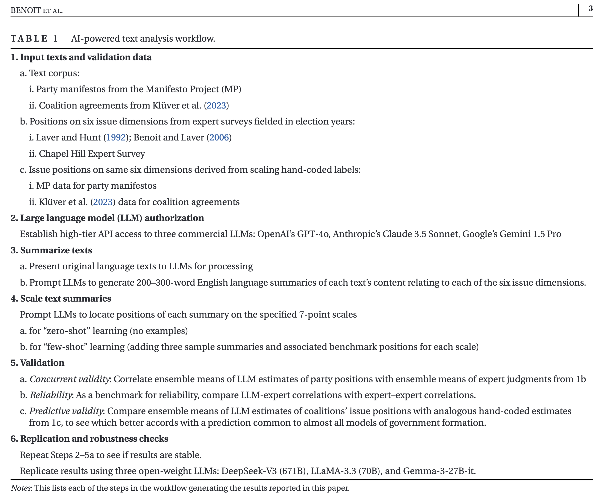
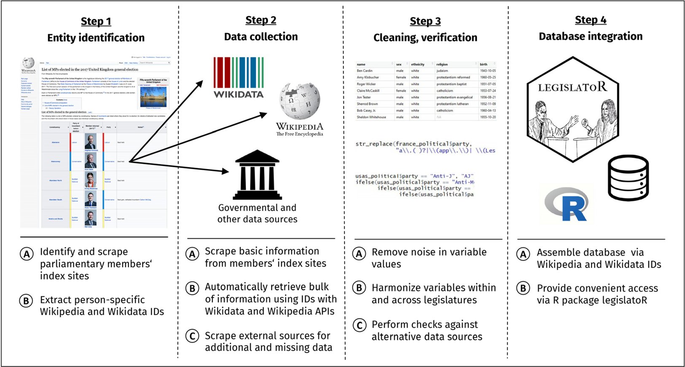
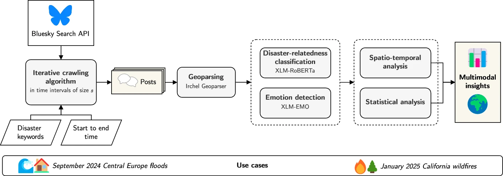
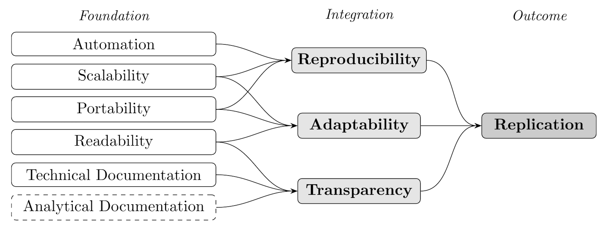
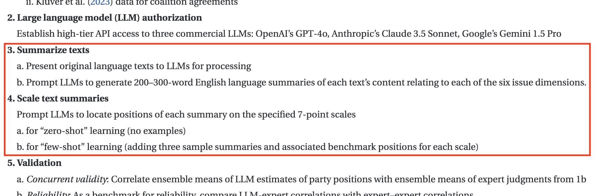
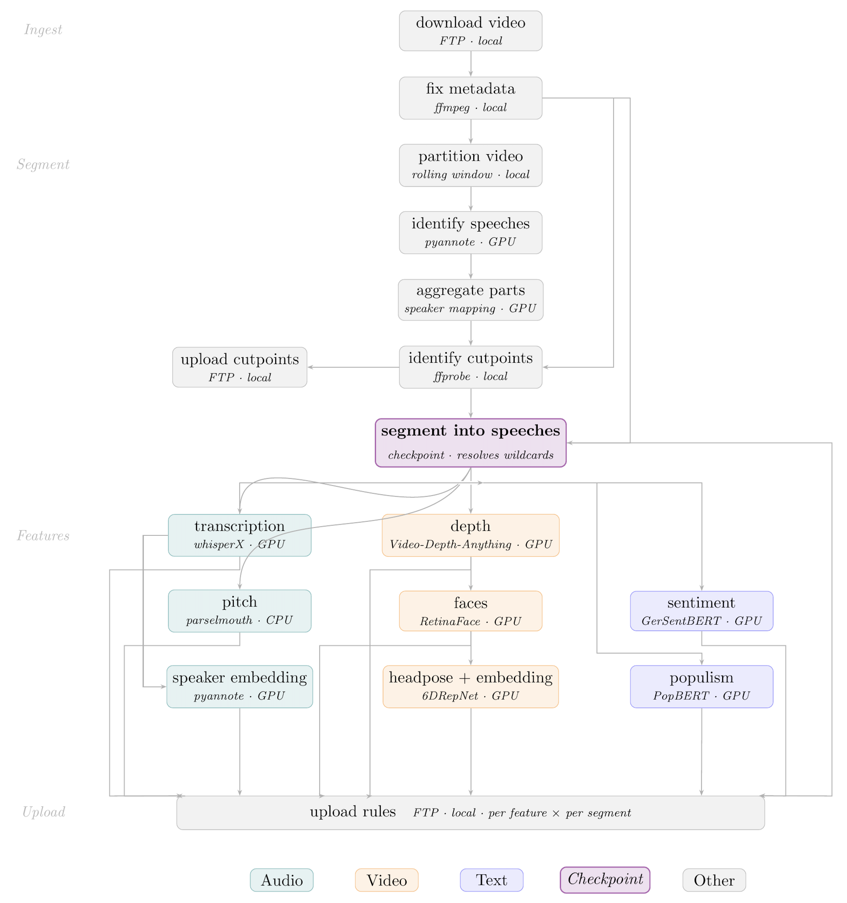
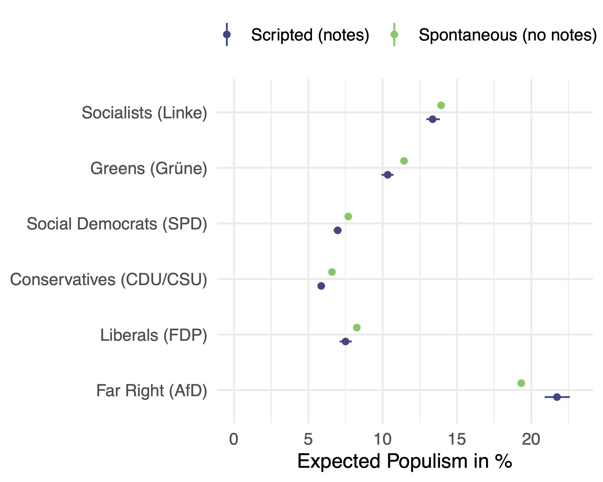

::: {.columns}
::: {.column width="50%"}

{height=10%}
*(Benoit et al., 2026)*
:::
::: {.column width="50%"}
{width=100%}
*(Göbel and Munzert, 2018)*

{width=100%}

*(Hanny et al., 2025)*
:::
:::

---

## CSS Pipelines Have Outgrown Their Infrastructure

CSS pipelines have grown:

- Large-n corpora: text, audio, image, video
- Multi-step processing chains involving different models and environments
- Workloads often exceeding a single machine

::: {.fragment}
But infrastructure has not kept pace: mostly still a collection of standalone scripts run by hand.
:::
---

## Six Infrastructure Issues in Current Practice (Adapted from *Mölder et al. (2021)*)

```{=html}
<div style="display: grid; grid-template-columns: 1fr 1fr; gap: 1em; font-size: 1em;">

  <div style="border-left: 3px solid #2a7ab5; padding: 0.5em 0.8em; background: #f5f8fc;">
    <div style="font-weight: 700; color: #1a1a2e;">Automation</div>
    <div style="margin-top: 0.15em;">Scripts executed by hand, in mental order</div>
    <div style="margin-top: 0.2em; color: #888; font-size: .9em;">→ Stale outputs; execution errors go undetected</div>
  </div>

  <div style="border-left: 3px solid #2a7ab5; padding: 0.5em 0.8em; background: #f5f8fc;">
    <div style="font-weight: 700; color: #1a1a2e;">Scalability</div>
    <div style="margin-top: 0.15em;">Code designed to fit a laptop</div>
    <div style="margin-top: 0.2em; color: #888; font-size: .9em;">→ Computationally intensive questions stay unanswered</div>
  </div>

  <div style="border-left: 3px solid #2a7ab5; padding: 0.5em 0.8em; background: #f5f8fc;">
    <div style="font-weight: 700; color: #1a1a2e;">Portability</div>
    <div style="margin-top: 0.15em;">Hardcoded paths, undeclared dependencies</div>
    <div style="margin-top: 0.2em; color: #888; font-size: .9em;">→ Code that works on one machine breaks silently on another</div>
  </div>

  <div style="border-left: 3px solid #2a7ab5; padding: 0.5em 0.8em; background: #f5f8fc;">
    <div style="font-weight: 700; color: #1a1a2e;">Readability</div>
    <div style="margin-top: 0.15em;">Scripts written for one-time use</div>
    <div style="margin-top: 0.2em; color: #888; font-size: .9em;">→ Replication is nominal; reuse often challening</div>
  </div>

  <div style="border-left: 3px solid #2a7ab5; padding: 0.5em 0.8em; background: #f5f8fc;">
    <div style="font-weight: 700; color: #1a1a2e;">Technical Documentation</div>
    <div style="margin-top: 0.15em;">No automatic logging</div>
    <div style="margin-top: 0.2em; color: #888; font-size: .9em;">→ Results cannot be traced to conditions of production</div>
  </div>

  <div style="border-left: 3px solid #2a7ab5; padding: 0.5em 0.8em; background: #f5f8fc;">
    <div style="font-weight: 700; color: #1a1a2e;">Analytical Documentation</div>
    <div style="margin-top: 0.15em;">Decisions undocumented in code</div>
    <div style="margin-top: 0.2em; color: #888; font-size: .9em;">→ Researcher degrees of freedom remain invisible</div>
  </div>

</div>
```

---

## {background-color="#1a1a2e" .center}

```{=html}
<div style="display:flex;flex-direction:column;align-items:center;justify-content:center;height:100%;color:white;gap:0.8em;">
  <div style="font-size:2.8em;font-weight:700;">Workflow Management Systems</div>
  <div style="width:50px;height:3px;background:#2a7ab5;border-radius:2px;"></div>
  <div style="font-size:1.5em;color:#aac4e0;">A systematic solution to an infrastructure problem</div>
</div>
```

---

## Framework: From Six Properties to Full Replication

::: {style="text-align: center;"}
{width=100% .nostretch}
:::


---

## Workflow Management Systems (WMS) Offer a Systematic Solution

::: {style="margin-bottom: 1.5em;"}
A WMS represents a pipeline as a **dependency graph**: each step declares its **inputs** and **outputs** while the system enforces order, detects stale outputs, and manages environments automatically.
:::

::: {.fragment .fade-in-then-out fragment-index=1 style="position: absolute; left: 0; right: 0; text-align: center; background: white; z-index: 5; padding: 0.5em;"}
{width=40%}

*(Benoit et al., 2026)*
:::

::: {.fragment .fade-in-then-out fragment-index=2 style="position: absolute; left: 0; right: 0; text-align: center; background: white; z-index: 5; padding: 0.5em;"}
{width=75%}

*(Benoit et al., 2026)*
:::

::: {.fragment .columns fragment-index=3}
::: {.column width="50%"}
**Snakemake as a WMS**

- Fastest end-to-end execution among WMS benchmarks *(Larsonneur et al., 2018)*
- 75% of public Snakemake repos have less than 23 rules *(Pohl et al., 2024)*
- Hundreds of citations annually in STEM; social sciences account for just >1% *(Mölder et al., 2021)*
:::

::: {.fragment .column width="45%" fragment-index=4}
```{.python}
rule summarize_texts:
    input:
        text    = "data/{speech}.txt"
    output:
        summary = "output/{speech}_summary.txt"
    script:
        "scripts/summarize.py"

rule scale_zeroshot:
    input:
        summary = "output/{speech}_summary.txt"
    output:
        scores  = "output/{speech}_scale_zeroshot.json"
    script:
        "scripts/scale_zeroshot.py"

rule scale_fewshot:
    input:
        summary    = "output/{speech}_summary.txt",
        benchmarks = "data/benchmark_examples.json"
    output:
        scores     = "output/{speech}_scale_fewshot.json"
    script:
        "scripts/scale_fewshot.py"
```

:::
:::

---

## WMS Pays Off Regardless of Where You Run

```{=html}
<div style="display: grid; grid-template-columns: 1fr 1fr; gap: 1.4em; font-size: 0.9em; margin-top: 0.5em;">

  <div class="fragment" data-fragment-index="1">
    <div style="font-weight: 700; color: #1a1a2e; font-size: 1em; margin-bottom: 0.6em; display: flex; align-items: center; gap: 0.4em;">
      Working locally
    </div>
    <div style="display: flex; flex-direction: column; gap: 0.5em;">

      <div style="border-left: 3px solid #2a7ab5; padding: 0.4em 0.8em; background: #f5f8fc;">
        <div style="font-weight: 600;">Isolated environments per rule</div>
        <div style="color: #555; font-size: .9em;">No more conflicting packages across Python, R, and model inference steps</div>
      </div>

      <div style="border-left: 3px solid #2a7ab5; padding: 0.4em 0.8em; background: #f5f8fc;">
        <div style="font-weight: 600;">Shareable by design</div>
        <div style="color: #555; font-size: .9em;">A collaborator clones the repo, runs one command, and gets the same result</div>
      </div>

      <div style="border-left: 3px solid #2a7ab5; padding: 0.4em 0.8em; background: #f5f8fc;">
        <div style="font-weight: 600;">Audit trail without effort</div>
        <div style="color: #555; font-size: .9em;">Every run is logged; reviewers can trace any output to its inputs</div>
      </div>

    </div>
  </div>

  <div class="fragment" data-fragment-index="2">
    <div style="font-weight: 700; color: #1a1a2e; font-size: 1em; margin-bottom: 0.6em; display: flex; align-items: center; gap: 0.4em;">
      Working on a cluster
    </div>
    <div style="display: flex; flex-direction: column; gap: 0.5em;">

      <div style="border-left: 3px solid #2a7ab5; padding: 0.4em 0.8em; background: #f5f8fc;">
        <div style="font-weight: 600;">Zero porting overhead</div>
        <div style="color: #555; font-size: .9em;">The same workflow runs on different clusters with a single profile flag</div>
      </div>

      <div style="border-left: 3px solid #2a7ab5; padding: 0.4em 0.8em; background: #f5f8fc;">
        <div style="font-weight: 600;">Automatic job submission</div>
        <div style="color: #555; font-size: .9em;">WMS submit and monitor many jobs in parallel; you don't manage the queue</div>
      </div>

      <div style="border-left: 3px solid #2a7ab5; padding: 0.4em 0.8em; background: #f5f8fc;">
        <div style="font-weight: 600;">Fault tolerance</div>
        <div style="color: #555; font-size: .9em;">Failed jobs rerun automatically; completed jobs are never recomputed</div>
      </div>

    </div>
  </div>

</div>
```


---

## Do you need a WMS? A Checklist for Social Scientists

```{=html}
<div style="display: grid; grid-template-columns: 2fr; gap: 1.2em; font-size: 0.84em;">

  <div>
    <div style="display: flex; flex-direction: column; gap: 0.45em;">

      <div class="fragment" data-fragment-index="1" style="display: flex; align-items: flex-start; gap: 0.5em; padding: 0.4em 0.7em; background: #f5f8fc; border-radius: 4px;">
        <div><span style="font-weight: 600;">More than one script?</span><br><span style="color: #555;">Your pipeline has steps that must run in order</span></div>
      </div>

      <div class="fragment" data-fragment-index="2" style="display: flex; align-items: flex-start; gap: 0.5em; padding: 0.4em 0.7em; background: #f5f8fc; border-radius: 4px;">
        <div><span style="font-weight: 600;">Do you re-run selectively?</span><br><span style="color: #555;">You mentally track which outputs are outdated</span></div>
      </div>

      <div class="fragment" data-fragment-index="3" style="display: flex; align-items: flex-start; gap: 0.5em; padding: 0.4em 0.7em; background: #f5f8fc; border-radius: 4px;">
        <div><span style="font-weight: 600;">Does processing take hours?</span><br><span style="color: #555;">A crash means starting over or patching by hand</span></div>
      </div>

      <div class="fragment" data-fragment-index="4" style="display: flex; align-items: flex-start; gap: 0.5em; padding: 0.4em 0.7em; background: #f5f8fc; border-radius: 4px;">
        <div><span style="font-weight: 600;">Working with collaborators?</span><br><span style="color: #555;">Others need to run and understand your code on a different machine</span></div>
      </div>

      <div class="fragment" data-fragment-index="5" style="display: flex; align-items: flex-start; gap: 0.5em; padding: 0.4em 0.7em; background: #f5f8fc; border-radius: 4px;">
        <div><span style="font-weight: 600;">Considering HPC or cloud?</span><br><span style="color: #555;">Your data exceeds what a laptop can handle</span></div>
      </div>

      <div class="fragment" data-fragment-index="6" style="display: flex; align-items: flex-start; gap: 0.5em; padding: 0.4em 0.7em; background: #f5f8fc; border-radius: 4px;">
        <div><span style="font-weight: 600;">Submitting to a journal?</span><br><span style="color: #555;">A third party needs to verify your results</span></div>
      </div>

    </div>
  </div>

</div>
```

---

## {background-color="#1a1a2e" .center}

```{=html}
<div style="display:flex;flex-direction:column;align-items:center;justify-content:center;height:100%;color:white;gap:0.8em;">
  <div style="font-size:2.8em;font-weight:700;">Snakemake in Practice</div>
  <div style="width:50px;height:3px;background:#2a7ab5;border-radius:2px;"></div>
  <div style="font-size:1.5em;color:#aac4e0;">30,000 hours of parliamentary video across 17 German parliaments</div>
</div>
```

---

## Application: A Snakemake Pipeline for 30,000 Hours of Parliamentary Video

::: {.columns}
::: {.column width="45%"}
**The corpus**

- All available speeches from the German Bundestag and all 16 state parliaments
- &gt;30,000 hours (>20TB) of footage
- ~170,000 individual uncut video files
- Heterogeneous across parliaments: format, segmentation, and recording quality vary widely

::: {.fragment}
**Performance with Snakemake**

~4 min 20 sec end-to-end for 1 hour of raw video
:::
:::
::: {.fragment .column width="55%"}
{width=80% fig-alt="Rule-level dependency graph of the Snakemake pipeline showing ingest, segment, feature extraction (audio: transcription, pitch, speaker embedding; video: depth, faces, headpose; text: sentiment, populism), and upload stages"}
:::
:::

---

## Application: Is Populist Rhetoric Spontaneous or Scripted?

::: {.columns}
::: {.column width="42%"}
**Research question**

Does populist rhetoric emerge organically in unscripted speech, or is it prepared in advance?

Gaze direction reveals delivery mode: looking at notes = scripted; looking at audience = more *spontaneous*.

::: {.fragment style="margin-top: 1.5em;"}
::: {style="margin-bottom: -.8em;"}
**Key findings**
:::

- **Mainstream parties**: *spontaneous* → more populist language
- **Far-Right AfD reverses**: scripted → more populist language (populism is a deliberate strategy)
:::
:::
::: {.column width="57%"}
{width=100%}
:::
:::

---

## Conclusion

WMS are an implicit implementation of the replication framework the discipline has long dicussed:

::: {.fragment}
- **Automation** removes human error and undocumented execution order
- **Scalability** breaks the infrastructural constraint that keeps CSS artificially smaller
- **Portability** reduces environment inconsistency across machines and over time
- **Readability** makes pipelines comprehensible enough to be reviewed, verified, and built upon
- **Technical Documentation** creates a provenance record automatically
- **Analytical Documentation** makes the garden of forking paths visible and auditable
:::

::: {.fragment}
Together, they fulfil what *King (1995)* demanded: sufficient information for a third party to understand, evaluate, and extend the work.
:::
---

## {.center background-color="#1a1a2e"}

```{=html}
<div style="display: flex; flex-direction: column; align-items: center; justify-content: center; height: 100%; color: white; gap: 1.2em;">

  <div style="font-size: 2em; font-weight: 700; letter-spacing: 0.03em;">Introducing Workflow Management to Computational Social Science</div>

  <div style="width: 60px; height: 3px; background: #2a7ab5; border-radius: 2px;"></div>

  <div style="display: flex; gap: 5em; margin-top: 0.4em; font-size: 0.95em;">
    <div style="text-align: center;">
      <div style="font-weight: 600; font-size: 1.05em;">Andreas Kuepfer</div>
      <div style="color: #aac4e0; margin-top: 0.2em;">TU Darmstadt</div>
      <div style="margin-top: 1em; font-size: 0.85em; color: #cce0f5; font-family: monospace;">andreas.kuepfer@tu-darmstadt.de</div>
      <div style="margin-top: 0.5em; font-size: 0.85em; color: #cce0f5; font-family: monospace;">andreaskuepfer.github.io</div>
      <div style="margin-top: 0.5em; font-size: 0.85em; color: #cce0f5; font-family: monospace;">ankuepfer.bsky.social</div>
    </div>
    <div style="text-align: center;">
      <div style="font-weight: 600; font-size: 1.05em;">Christian Arnold</div>
      <div style="color: #aac4e0; margin-top: 0.2em;">University of Birmingham</div>
      <div style="margin-top: 1em; font-size: 0.85em; color: #cce0f5; font-family: monospace;">c.arnold.2@bham.ac.uk</div>
      <div style="margin-top: 0.5em; font-size: 0.85em; color: #cce0f5; font-family: monospace;">chrisguarnold.github.io</div>
      <div style="margin-top: 0.5em; font-size: 0.85em; color: #cce0f5; font-family: monospace;">chrisguarnold.bsky.social</div>
    </div>
  </div>

  <div style="margin-top: 0.6em; font-size: 0.78em; color: #7aa8cc; letter-spacing: 0.05em; text-transform: uppercase;">
    ParliView Workshop | May 12, 2026 | University College Dublin, Ireland
  </div>

</div>
```


```{=html}
<script>
function updateFooter() {
  const footer = document.querySelector('.reveal > .footer');
  if (!footer) return;
  const current = Reveal.getCurrentSlide();
  const isFirst = current && current.id === 'title-slide';
  const isLast = Reveal.isLastSlide();
  footer.style.display = (isFirst || isLast) ? 'none' : '';
}
Reveal.on('ready', updateFooter);
Reveal.on('slidechanged', updateFooter);
</script>
```
