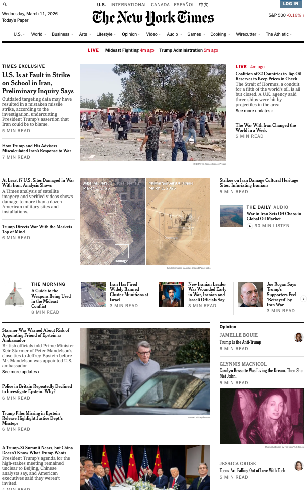
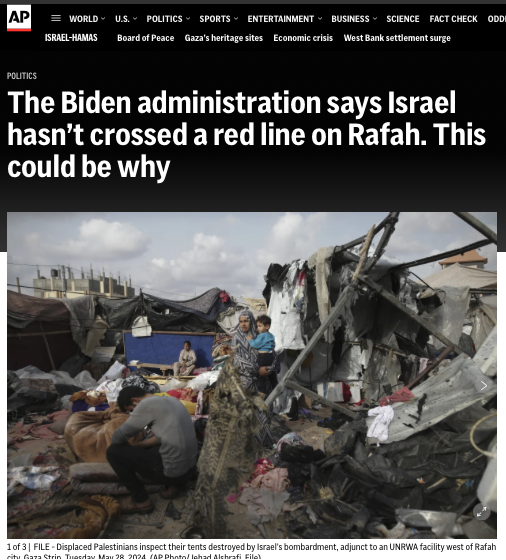
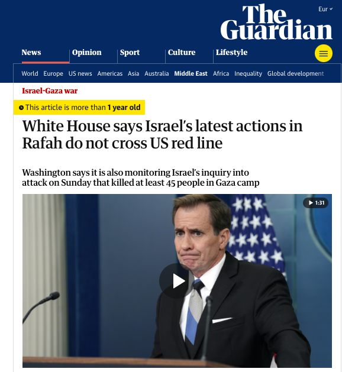
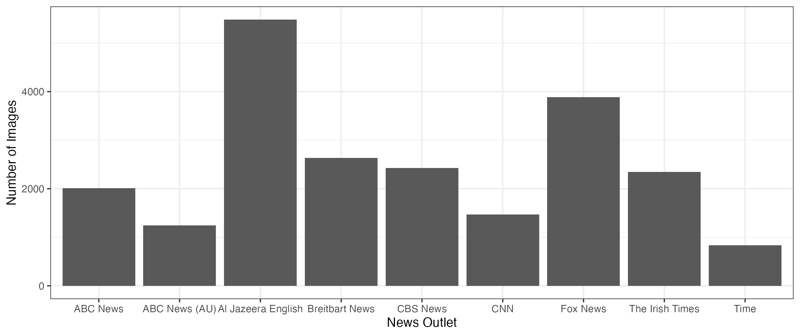
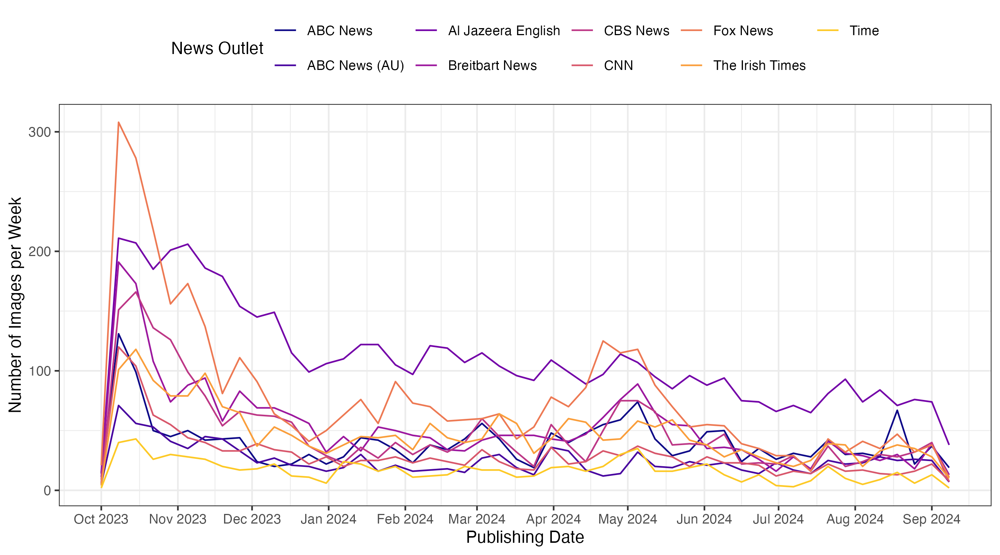

## Images Dominate News Websites {.smaller}

:::: {.columns}
::: {.column width="30%"}
{width=100%}
New York Times, March 11, 2026
:::
::: {.column width="4%"}
:::
::: {.column width="30%"}

{width=100%}
CNN, March 11, 2026
:::
::: {.column width="4%"}
:::
::: {.column width="30%"}

{width=100%}
Bild, March 11, 2026
:::
::::


## The Same Event, Pictured Differently {.smaller}

:::: {.columns}
::: {.column width="40%"}
{width=100%}

AP News, June 1, 2024
:::
::: {.column width="10%"}
:::
::: {.column width="40%"}

{width=100%}
Guardian, May 29, 2024 


:::
::::


## Images Are Central in Modern Media Environments, Yet Unmeasured

- Images are omnipresent in news media, particularly online
- Images shape the perceptions of events, potentially more forcefully than text

<br>

- We know about textual media slant based, but what about visual reporting?
- **Difficult to answer due to methodological hurdles**: <br> → how to analyse visual slant on a large scale?

. . .

## This Study

> **Our goal:** <br> Develop a method to **measure media slant** based on the **visual reporting** of media outlets on specific events.

<br>

1. **We develope a two-step, unsupervised framework for scaling images**
2. **Application:** Visual reporting on the Gaza war, 10 outlets, Oct 2023--Oct 2024
  - Evidence for media slant in visual reporting, particularly for right-wing media


# Framework

## Framework: Two Steps

> **Core assumption:** News outlets that are close to each other in the latent space will, on average, use more similar news imagery.

1. **Measurement of image similarity**
    - Encode each image with a pre-trained **Vision Transformer (ViT)**
    <br> → extract the `[CLS]` token embedding (512 dims)
    <br> → compute pairwise **cosine similarities** across all image dyads
2. **Statistical model to analyse image similarity**
    - Additive-Multiplicative Effects (AME) network model to recover latent positions of
    <br> (a) **media outlets** based on the news imagery used by them and 
    <br> (b) **images** themselves


## Step 2: The AME Model

Additive-multiplicative effects *(Hoff 2005, 2021)* — outlet level:

$$\mathrm{atanh}\!\left(\mathrm{sim}(\vec{E}_i, \vec{E}_j)\right) = \mu + \alpha_{O_i} + \alpha_{O_j} + \vec{S}_{O_i}^\top \vec{S}_{O_j} + \epsilon_{ij}$$


## Step 2: The AME Model

Additive-multiplicative effects *(Hoff 2005, 2021)* — outlet level:

$$\textcolor{lightgray}{\mathrm{atanh}\!\left(\textcolor{teal}{\mathrm{sim}(\vec{E}_i, \vec{E}_j)}\right) =} \textcolor{lightgray}{\mu + \alpha_{O_i} + \alpha_{O_j} + \vec{S}_{O_i}^\top \vec{S}_{O_j} + \epsilon_{ij}}$$

<br>


$\textcolor{teal}{\mathrm{sim}(\vec{E}_i, \vec{E}_j)}$ is the **cosine similarity** between the ViT embeddings of images $i$ and $j$.


## Step 2: The AME Model

Additive-multiplicative effects *(Hoff 2005, 2021)* — outlet level:

$$\textcolor{lightgray}{\mathrm{atanh}\!\left(\mathrm{sim}(\vec{E}_i, \vec{E}_j)\right)} = \textcolor{lightgray}{\mu} + \textcolor{lightgray}{\alpha_{O_i} + \alpha_{O_j}} + \textcolor{red}{\vec{S}_{O_i}^\top \vec{S}_{O_j}} + \textcolor{lightgray}{\epsilon_{ij}}$$

<br>

[$\vec{S}_{O_i}$]{style="color: red"}: Latent position of outlet $O$ that posted image $i$

[$\vec{S}_{O_j}$]{style="color: red"}: Latent position of outlet $O$ that posted image $j$

. . .

<br>

| Configuration | $S_i \cdot S_j$ | Predicted image similarity |
|:-----|:---:|:-----|
| Same pole $(+,+)$ or $(-,-)$ | $>0$ | above baseline |
| Opposite poles $(+,-)$ | $<0$ | below baseline |


## Image-Level Model

Assign a position directly to each images rather than outlets:

$$\mathrm{atanh}\!\left(\mathrm{sim}(\vec{E}_i, \vec{E}_j)\right) = \mu + \textcolor{red}{\vec{S}_i^\top \vec{S}_j} + \epsilon_{ij}, \quad \epsilon_{ij} \sim \mathcal{N}(0,\sigma^2)$$

<br>

[$\vec{S}_i$]{style="color: red"} **Latent scale position of image $i$**

<br>

- Estimated in a **Bayesian** framework
- No labelled data required


# Case Study: Gaza War, 2023--2024


## Data: Visual Reporting on the Gaza War


**Corpus**

- Around 17,000 photographs
- 10 news outlets, mostly US:
  - *US:* ABC, CBS, CNN, Fox News, Breitbart, NBC, Time
  - *Intl.:* Al Jazeera English, Irish Times, ABC (AUS)
- Source: NewsAPI + top article image

. . . 

> **Leading Question:** <br> Can we recover media slant *exclusively* based on news imagery?

# Results


## Outlet-Level Visual Slant

```{r outlet-level-1, width = 10, cache=T}
library(here)
source(here("Code/oli/text_image_scaling/x_presentation/code/01_outlet_scaling_source.R"))

plot_posterior_z(z_draws_aligned_img,
                 den_scale = 0.005,
                 cex = 1,
                 xlim = c(-0.15, 0.15),
                 empty = T)

```

## Outlet-Level Visual Slant

```{r outlet-level-2, width = 10, cache=T}
plot_posterior_z(z_draws_aligned_img,
                 den_scale = 0.005,
                 cex = 1,
                 xlim = c(-0.15, 0.15),
                 empty = F,
                 subset = c("Fox News", "Breitbart News"))

```

## Outlet-Level Visual Slant

```{r outlet-level-3, width = 10, cache=T}
plot_posterior_z(z_draws_aligned_img,
                 den_scale = 0.005,
                 cex = 1,
                 xlim = c(-0.15, 0.15),
                 empty = F,
                 subset = c("Fox News", "Breitbart News",
                            "Al Jazeera English", "CNN"))

```

## Outlet-Level Visual Slant

```{r outlet-level-4, width = 10, cache=T}
plot_posterior_z(z_draws_aligned_img,
                 den_scale = 0.005,
                 cex = 1,
                 xlim = c(-0.15, 0.15),
                 empty = F)

```


## Image-Level: What Is on the Scale?

```{r image-level-2, height = 6, width = 9, cache=T}

par(family = "serif",
    mar = c(5, 0, 0, 0) + 0.1)

hist(images$z_mean, 
     breaks = 50,
     prob = T,
     xlim = c(-1,1.2),
     main = "",
     font.main = 1,
     yaxt = "n",
     xaxt = "n",
     xlab = "Latent Image Coordinates",
     ylab = "",
     border = cividis(8, 1)[7],
     col = cividis(8, 1)[7])
axis(1,
     at = c(round(min(images$z_mean), 2), 
            seq(-0.25, 0.5, 0.25), 
            round(max(images$z_mean), 2)))

```

## Image-Level: What Is on the Scale?

```{r image-level-3, height = 6, width = 9, cache=T}

par(family = "serif",
    mar = c(5, 0, 0, 0) + 0.1)

hist(images$z_mean, 
     breaks = 50,
     prob = T,
     xlim = c(-1,1.2),
     main = "",
     font.main = 1,
     yaxt = "n",
     xaxt = "n",
     xlab = "Latent Image Coordinates",
     ylab = "",
     border = cividis(8, 1)[7],
     col = cividis(8, 1)[7])
axis(1,
     at = c(round(min(images$z_mean), 2), 
            seq(-0.25, 0.5, 0.25), 
            round(max(images$z_mean), 2)))


add_image(img_name = img_lo1, x_center = -0.9, y_center = 0.25, num = 1)
add_image(img_name = img_lo2, x_center = -0.9, y_center = 0.75, num = 2)
add_image(img_name = img_lo3, x_center = -0.9, y_center = 1.25, num = 3)
add_image(img_name = img_lo4, x_center = -0.9, y_center = 1.75, num = 4)
#add_image(img_name = img_lo6, x_center = -0.9, y_center = 1.75, num = 4)
add_image(img_name = img_lo5, x_center = -0.9, y_center = 2.25, num = 5)

```


## Image-Level: What Is on the Scale?

```{r image-level-4, height = 6, width = 9, cache=T}

par(family = "serif",
    mar = c(5, 0, 0, 0) + 0.1)

hist(images$z_mean, 
     breaks = 50,
     prob = T,
     xlim = c(-1,1.2),
     main = "",
     font.main = 1,
     yaxt = "n",
     xaxt = "n",
     xlab = "Latent Image Coordinates",
     ylab = "",
     border = cividis(8, 1)[7],
     col = cividis(8, 1)[7])
axis(1,
     at = c(round(min(images$z_mean), 2), 
            seq(-0.25, 0.5, 0.25), 
            round(max(images$z_mean), 2)))


add_image(img_name = img_lo1, x_center = -0.9, y_center = 0.25, num = 1)
add_image(img_name = img_lo2, x_center = -0.9, y_center = 0.75, num = 2)
add_image(img_name = img_lo3, x_center = -0.9, y_center = 1.25, num = 3)
add_image(img_name = img_lo4, x_center = -0.9, y_center = 1.75, num = 4)
#add_image(img_name = img_lo6, x_center = -0.9, y_center = 1.75, num = 4)
add_image(img_name = img_lo5, x_center = -0.9, y_center = 2.25, num = 5)

#add_image(img_name = img_lo8, x_center = -0.3, y_center = 2.25, num = 44)

add_image(img_name = img_hi1, x_center = 1.1, y_center = 0.25, num = 10, num_right = F)
add_image(img_name = img_hi2, x_center = 1.1, y_center = 0.75, num = 9, num_right = F)
add_image(img_name = img_hi3, x_center = 1.1, y_center = 1.25, num = 8, num_right = F)
#add_image(img_name = img_hi8, x_center = 1.1, y_center = 1.25, num = 8, num_right = F)
add_image(img_name = img_hi4, x_center = 1.1, y_center = 1.75, num = 7, num_right = F)
#add_image(img_name = img_hi6, x_center = 1.1, y_center = 2.25, num = 6, num_right = F)
add_image(img_name = img_hi7, x_center = 1.1, y_center = 2.25, num = 6, num_right = F)
#add_image(img_name = img_hi5, x_center = 1.1, y_center = 2.25, num = 6, num_right = F)

```

# Conclusion


## Conclusion and Future Directions

**Contribution:**

- Scalable framework for recovering latent positions from visual corpora
  - Method to measure visual slant in news media

. . .

**Findings on Gaza War coverage:**

- Far-right outlets share a distinctive visual repertoire; Al Jazeera diverges sharply
- Scale captures a substantively meaningful dimension: elite framing vs. humanitarian suffering

. . .

**Future directions:**

- *Multimodal scaling:* integrate text and image in a shared embedding space


## {background-color="#1d3557"}

::: {style="color: white; text-align: center; margin-top: 20%;"}

Measuring Media Slant through Image Analysis

<br>

<br>

Christian Arnold · Andreas Küpfer · Oliver Rittmann · Michelle Torres

:::


# Appendix {visibility="uncounted"}

## Appendix: Dynamic Visual Slant: Stable Sorting, Parallel Dynamics

```{r img-time-5, width = 14, height = 8, cache=T}

par(mar = c(5, 4, 1, 2) + 0.1)

plot(x = image_data$date,
     y = image_data$z_mean_comb,
     col = "grey80",
     las = 1,
     xlab = "Date (October 7, 2023 to September 1, 2024)",
     ylab = "Latent Position",
     type = "n",
     xlim = c(lubridate::ymd("2023-09-01"), 
              lubridate::ymd("2024-09-01")),
     ylim = c(-0.3, 0.3),
     xaxt = "n")

axis(1,
     at = as.Date(c("2023-10-07", 
                    "2023-11-01",
                    "2023-12-01",
                    "2024-1-01",
                    "2024-2-01",
                    "2024-3-01",
                    "2024-4-01",
                    "2024-5-01",
                    "2024-6-01",
                    "2024-7-01",
                    "2024-8-01",
                    "2024-9-01")),
     labels = c("Oct. 7,\n2023", 
                "Nov. 1,\n2023",
                "Dec. 1,\n2023",
                "Jan. 1,\n2024",
                "Feb. 1,\n2024",
                "Mar. 1,\n2024",
                "Apr. 1,\n2024",
                "May 1,\n2024",
                "Jun. 1,\n2024",
                "Jul. 1,\n2024",
                "Aug. 1,\n2024",
                "Sep. 1,\n2024"),
     las = 1,
     padj = 0.3,
     cex.axis = 0.75)

grid()
abline(h=0)
clip(x1 = lubridate::ymd("2023-01-07"),
     x2 = lubridate::ymd("2024-09-01"),
     y1 = -100,
     y2 = 100)

loess_span <- 0.25
# Al Jazeera
add_loess(image_data = image_data[image_data$source == "Al Jazeera English",],
          col_ci = viridis(5, 0.4)[1],
          col_line = viridis(5)[1],
          outlet_label = "Al Jazeera\nEnglish",
          label_yshift = -0.02,
          loess_span = loess_span)

# Fox News
add_loess(image_data = image_data[image_data$source == "Fox News",],
          col_ci = viridis(5, 0.4)[2],
          col_line = viridis(5)[2],
          outlet_label = "Fox News",
          label_yshift = -0.01,
          loess_span = loess_span)

# Breitbart
add_loess(image_data = image_data[image_data$source == "Breitbart News",],
          col_ci = viridis(5, 0.4)[3],
          col_line = viridis(5)[3],
          outlet_label = "Breitbart News",
          label_yshift = +0.005,
          loess_span = loess_span)

# CNN
add_loess(image_data = image_data[image_data$source == "CNN",],
          col_ci = viridis(5, 0.4)[4],
          col_line = viridis(5)[4],
          outlet_label = "CNN",
          loess_span = loess_span)
```

## Appendix: Images per Outlet {visibility="uncounted"}

{width=100%}


## Appendix: Images per Outlet over Time {visibility="uncounted"}

{width=90%}

## Appendix: Step 2: The AME Model

Additive-multiplicative effects *(Hoff 2005, 2021)* — outlet level:

$$\textcolor{lightgray}{\mathrm{atanh}\!\left(\mathrm{sim}(\vec{E}_i, \vec{E}_j)\right)} = \textcolor{blue}{\mu} + \textcolor{lightgray}{\alpha_{O_i} + \alpha_{O_j}} + \textcolor{lightgray}{\vec{S}_{O_i}^\top \vec{S}_{O_j}} + \textcolor{lightgray}{\epsilon_{ij}}$$

<br>

[$\mu$]{style="color: blue"} is the **global baseline** similarity of news imagery across outlet pairs.


## Appendix: Step 2: The AME Model

Additive-multiplicative effects *(Hoff 2005, 2021)* — outlet level:

$$\textcolor{lightgray}{\mathrm{atanh}\!\left(\mathrm{sim}(\vec{E}_i, \vec{E}_j)\right)} = \textcolor{lightgray}{\mu} + \textcolor{orange}{\alpha_{O_i} + \alpha_{O_j}} + \textcolor{lightgray}{\vec{S}_{O_i}^\top \vec{S}_{O_j}} + \textcolor{lightgray}{\epsilon_{ij}}$$

<br>

[$\alpha_{O_i}$]{style="color: orange"}: Random effects for outlet $O$ that posted image $i$.


[$\alpha_{O_j}$]{style="color: orange"}: Random effects for outlet $O$ that posted image $j$.
